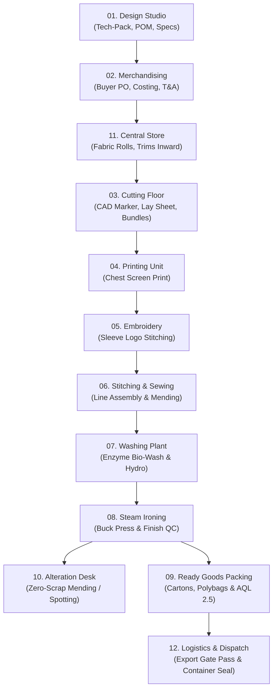

# Zigza Enterprise MES — Master End-to-End Operational Flow & Interactive Simulation Guide

> **Document Version**: 2.0 (Live Canonical Simulation Blueprint)  
> **Target Audience**: Factory Admins, QA Engineers, Enterprise Clients & AI Evaluators  
> **Simulation Scope**: Complete Garment Manufacturing Lifecycle from **Division 01 (Design Studio)** &rarr; **Division 12 (Export Dispatch)**  
> **Primary Simulation Case Study**:  
> - **Buyer / Brand**: `ZARA INTERNATIONAL` (Brand Code: `ZARA`)  
> - **Style Number**: `TP-2026-8801`  
> - **Style Name**: `Heavyweight Relaxed French Terry Hoodie`  
> - **Purchase Order**: `PO-2026-9901`  
> - **Order Quantity**: `1,000 pcs` (Black: 500 pcs [S:100, M:200, L:150, XL:50], Sage Olive: 500 pcs [S:100, M:200, L:150, XL:50])  
> - **Fabric Spec**: `100% Combed Cotton French Terry (380 GSM)`  
> - **FOB Price**: `₹1,450.00 / pc` | **Total Contract Value**: `₹14,50,000.00`

---

## 🗺️ Master Lifecycle Architecture & Sequence Map

---

# 🧵 Phase 1: Division 01 — Design & Tech-Pack Studio

### Goal
Define the technical engineering specification, CAD vectors, grade rules, and stitches-per-inch (SPI) before taking commercial buyer orders.

---

### Page 1.1: Tech-Pack Master Catalog (`/design/tech-packs`)
- **Page Function**: Technical specification archive, CAD parameters, size system categorization, and 2-step stepper wizard.
- **Action / What to Click**:
  1. Click the top-right button **`+ New Tech-Pack`**.
  2. In **Step 1 (Garment Metadata & Fabric)**:
     - **Style Number**: Type `TP-2026-8801`
     - **Style Name**: Type `Heavyweight Relaxed French Terry Hoodie`
     - **Brand / Client**: Select `ZARA INTERNATIONAL` (or type `ZARA`)
     - **Garment Category**: Select `Hoodie`
     - **Size System**: Select `Adult Unisex Alpha (XS–3XL)`
     - **Base Size**: Select `M`
     - **Fabric Composition**: Type `100% Combed Cotton French Terry`
     - **Target GSM**: Type `380`
     - Click **`Next Step`**.
  3. In **Step 2 (Stitches & Seam Specs)**:
     - **Embellishment Sequence**: Select `Print First, Then Embroidery`
     - **Stitches Per Inch (SPI)**: Type `12`
     - **Seam Class**: Select `ISO 4915 Class 504 (Overlock)`
     - **Target Cut Date**: Select 14 days from today
     - Click **`Create Specification`**.
- **Expected Result**:
  - A green toast appears: *"Tech-Pack TP-2026-8801 created in Supabase!"*
  - The modal closes immediately, and `TP-2026-8801` appears at the top of the Gallery/Table with a `DRAFT` status badge and `380 GSM` fabric tags.

---

### Page 1.2: Sample Approvals & Fit Tracker (`/design/sample-approvals`)
- **Page Function**: Manages the pre-production sample lifecycle (Proto &rarr; Fit &rarr; PPS &rarr; Size Set &rarr; TOP).
- **Action / What to Click**:
  1. Click **`+ Book Sample Fit Request`**.
  2. Select Style: `TP-2026-8801`.
  3. Sample Stage: Select `PPS (Pre-Production Sample)`.
  4. Assigned Tailor / Pattern Master: Type `Master K. Ramanathan`.
  5. Measurement Delta: Type `0.2 cm`.
  6. Click **`Register Sample Round`**.
  7. On the newly created row, click the action button **`Approve Fit & Release to Merchandising`**.
- **Expected Result**:
  - Sample status updates to `APPROVED` with an emerald badge.
  - Tech-pack `TP-2026-8801` status advances from `DRAFT` &rarr; `PPS_APPROVED`.

---

### Page 1.3: Industrial Grading Matrix (`/design/grading-matrix`)
- **Page Function**: Multi-size point-of-measure (POM) grade rules from XS to 3XL.
- **Action / What to Click**:
  1. Filter by Style: Select `TP-2026-8801`.
  2. Inspect the automated grade increments:
     - Chest Width: Base M = `56.0 cm`, Grade Step = `+2.5 cm` (S: `53.5`, L: `58.5`, XL: `61.0`).
     - Body Length: Base M = `72.0 cm`, Grade Step = `+2.0 cm`.
- **Expected Result**:
  - Visual matrix calculates automated size tolerances with zero grade overlap alarms.

---

### Page 1.4: Materials & Trims Library (`/design/materials-library`)
- **Page Function**: Technical specs for base shell fabrics, ribs, zippers, drawcords, and neck tapes.
- **Action / What to Click**:
  1. Click **`+ Add Raw Material Spec`**.
  2. Material Name: `380 GSM Heavy French Terry - Sage Olive`.
  3. Material Type: Select `KNIT_SHELL`.
  4. Composition: `100% Combed Cotton`.
  5. Click **`Save to Studio Archive`**.
- **Expected Result**:
  - Material is cataloged and available for pre-production BOM costing.

---

# 💼 Phase 2: Division 02 — Merchandising & Commercial Ops

### Goal
Book the official buyer commercial contract, construct the Bill of Materials (BOM) Costing Sheet, and establish the Time & Action (T&A) calendar.

---

### Page 2.1: Buyer Purchase Orders (PO) Ledger (`/merchandising/orders`)
- **Page Function**: Master commercial sales order registry, size breakdown matrix, and revenue ledger.
- **Action / What to Click**:
  1. Click **`+ Book New Buyer PO`**.
  2. **PO Number**: Type `PO-2026-9901`
  3. **Brand / Buyer**: Select `ZARA INTERNATIONAL`
  4. **Approved Style**: Select `TP-2026-8801 (Heavyweight Relaxed French Terry Hoodie)`
  5. **Total Order Quantity**: Type `1000`
  6. **FOB Price per Piece (₹)**: Type `1450`
  7. **Currency**: Select `INR`
  8. **Ex-Factory Shipping Date**: Set date to 25 days from today
  9. **Color & Size Matrix**:
     - Row 1: Color `Obsidian Black` | S: `100`, M: `200`, L: `150`, XL: `50` (Subtotal: `500 pcs`)
     - Row 2: Color `Sage Olive` | S: `100`, M: `200`, L: `150`, XL: `50` (Subtotal: `500 pcs`)
  10. Click **`Book Commercial Contract`**.
- **Expected Result**:
  - `PO-2026-9901` is confirmed in database with total revenue `₹14,50,000.00`.
  - The order status pill displays `BOOKED` with `1,000 pcs contracted`.

---

### Page 2.2: Pre-Production BOM Costing & Yield (`/merchandising/costing`)
- **Page Function**: Pre-costing vs actual margin calculations across Fabric, Trims, CMT, Printing, Embroidery, and Logistics.
- **Action / What to Click**:
  1. Click **`+ Generate BOM Costing Sheet`**.
  2. Link PO: Select `PO-2026-9901`.
  3. **Fabric Yield**: `0.85 meters / piece` @ `₹680.00 / meter` (Cost: `₹578.00`)
  4. **Trims & Packaging (BOM)**: `₹145.00 / piece` (Thread, eyelets, 15mm drawcord, main woven label, polybag)
  5. **Printing & Embroidery Cost**: `₹95.00 / piece`
  6. **CMT Sewing Cost**: `₹280.00 / piece`
  7. **Washing & Finishing**: `₹75.00 / piece`
  8. **Factory Target Margin**: `19.1%` (Profit: `₹277.00 / pc`)
  9. Click **`Lock & Authorize BOM Costing`**.
- **Expected Result**:
  - BOM costing status updates to `LOCKED & APPROVED`.
  - Automated procurement requisitions are created for Central Store.

---

### Page 2.3: Time & Action (T&A) Critical Path (`/merchandising/tna-calendar`)
- **Page Function**: Critical milestone Gantt tracking (Yarn &rarr; Lab Dip &rarr; Fabric Inward &rarr; Cut &rarr; Sew &rarr; Pack &rarr; Ex-Factory).
- **Action / What to Click**:
  1. Select PO: `PO-2026-9901`.
  2. Inspect the automated critical milestones generated:
     - `Fabric Roll Godown Inward`: Target Day 3 &rarr; Status: `PENDING`
     - `CAD Marker & Bulk Lay Spreading`: Target Day 5
     - `Sewing Line Handovers`: Target Day 10
     - `AQL 2.5 Buyer Audit & Dispatch`: Target Day 23
- **Expected Result**:
  - Milestone health indicates `ON_TRACK (Green)` with 0 buffer alarms.

---

### Page 2.4: Sourcing Requisitions (`/merchandising/sourcing`)
- **Page Function**: Generates Purchase Requisitions (PR) for raw yarn, knitted fabric rolls, and trims.
- **Action / What to Click**:
  1. Click **`+ Create Sourcing PR`**.
  2. Select Order: `PO-2026-9901`.
  3. Item: `100% Combed Cotton French Terry (Obsidian Black & Sage Olive)`.
  4. Required Quantity: `900.0 meters`.
  5. Supplier Mill: `Vardhman Textiles Ltd`.
  6. Click **`Dispatch Mill Purchase Order`**.
- **Expected Result**:
  - PR status becomes `ISSUED_TO_MILL`. Expected truck delivery is logged for Central Store Godown.

---

# 📦 Phase 3: Division 11 — Central Store & Raw Material Godown

### Goal
Inward raw fabric truck deliveries, perform ASTM D5430 4-point inspection, catalog trims, and issue barcode-verified challans to the cutting floor.

---

### Page 3.1: Fabric Godown & 4-Point Roll Inspection (`/store/fabric-godown`)
- **Page Function**: Stores fabric rolls with barcode tracking, shade grouping, width verification, and defect scoring.
- **Action / What to Click**:
  1. Click **`+ Inward Fabric Rolls`**.
  2. Roll Barcode: `ROL-2026-9901`
  3. Fabric Composition: `100% Combed Cotton French Terry (380 GSM)`
  4. Colorway / Shade: `Obsidian Black (Shade Group A)`
  5. Gross Length: `450.0 meters` | Usable Width: `60 inches`
  6. Supplier: `Vardhman Textiles Ltd`
  7. **ASTM 4-Point Inspection Scoring**:
     - Points recorded: `6 points per 100 sq yds` (Passing threshold is `< 20 points`)
     - Status: Select `PASSED_A_GRADE`
  8. Click **`Accept Roll into Bin A-04`**.
  9. Repeat for second roll:
     - Barcode: `ROL-2026-9902` | Colorway: `Sage Olive (Shade Group B)` | Gross: `450.0 meters` | Status: `PASSED_A_GRADE`.
- **Expected Result**:
  - Total Fabric Stock increases by `900.0 Meters`.
  - Roll cards appear in `PASSED` state ready for CAD table spreading.

---

### Page 3.2: Trims & Accessories Warehouse (`/store/trims-warehouse`)
- **Page Function**: Real-time stock ledger for sewing threads, woven labels, polybags, drawcords, and zippers.
- **Action / What to Click**:
  1. Click **`+ Receive Trims Package`**.
  2. Item: `15mm Cotton Flat Drawcord with Gunmetal Aglets`.
  3. Linked Order: `PO-2026-9901`.
  4. Inward Qty: `1,000 pcs` | Location: `Rack T-12`.
  5. Click **`Accept Trims Batch`**.
- **Expected Result**:
  - Trims warehouse logs `1,000 pcs` allocated for `PO-2026-9901`.

---

### Page 3.3: Material Issues to Floor & Delivery Challan (`/store/material-issues`)
- **Page Function**: Generates barcode-verified Delivery Challans to transfer raw materials to shop-floor divisions.
- **Action / What to Click**:
  1. Click **`Issue Material to Floor`**.
  2. In the modal:
     - **Issue Challan Number**: `CHL-FLR-2026-101`
     - **Destination Shop Floor**: Select `Division 03 • Cutting Floor (Fabric Rolls)`
     - **Production Order**: `PO-2026-9901`
     - **Article No**: `TP-2026-8801`
     - **Buyer Client**: `ZARA INTERNATIONAL`
     - **Scanned Barcodes**: `ROL-2026-9901, ROL-2026-9902`
     - **Material Description**: `100% Cotton French Terry 380 GSM (Black & Olive)`
     - **Qty & Unit**: `900.0 meters`
     - **Receiver Floor Supervisor**: `Cutting Master R. Veerappan`
     - **Dispatching Storekeeper**: `Store Incharge Suresh Kumar`
     - Click **`Authorize Challan Dispatch`**.
- **Expected Result**:
  - Challan appears in the ledger with status `IN_TRANSIT_TO_FLOOR`.
  - On the challan row, click **`Accept Handshake`** (simulating shop floor handover). Status advances to `ACCEPTED_BY_FLOOR`.

---

# ✂️ Phase 4: Division 03 — CAD Table & Automated Cutting Floor

### Goal
Nest CAD pattern markers for maximum yield, spread fabric plies on vacuum tables, cut garment panels, and serialize QR bundle tickets.

---

### Page 4.1: CAD Marker Efficiency & Nesting Library (`/cutting/markers`)
- **Page Function**: CAD nesting layouts, cut-width tolerances, ratio combinations, and fabric utilization benchmarking.
- **Action / What to Click**:
  1. Click **`+ New CAD Marker`**.
  2. **Marker Reference**: `MKR-ZARA-HD-8801`
  3. **Style Reference**: `TP-2026-8801`
  4. **CAD Software Engine**: Select `GERBER ACCUMARK`
  5. **Bed Cut Width**: `60 inches` | **Marker Length**: `5.4 meters`
  6. **Efficiency Yield**: Type `89.6%` (Exceeds 86% floor benchmark)
  7. **Sizes & Ratio**: `S:1, M:2, L:2, XL:1 (Ratio: 6)`
  8. Click **`Save CAD Marker Profile`**.
- **Expected Result**:
  - Marker is registered with `89.6% Fabric Nesting Utilization`.
  - Top Yield Benchmark KPI updates to `89.6%`.

---

### Page 4.2: Cutting Orders & Machine Dispatch Queue (`/cutting/orders`)
- **Page Function**: Machine table queue sequencing, ply targets, and table allocation.
- **Action / What to Click**:
  1. Click **`+ Dispatch Cut Work Order`**.
  2. **Order Number**: `CO-2026-088`
  3. **Buyer PO**: `PO-2026-9901` | **Buyer**: `ZARA INTERNATIONAL`
  4. **Style Spec**: `TP-2026-8801 (Heavyweight Relaxed French Terry Hoodie)`
  5. **Colorway**: `Obsidian Black & Sage Olive`
  6. **Target Pieces**: `1,000 pcs` | **Planned Plies**: `84 plies`
  7. **Assigned Table**: Select `Table 01 - Gerber Paragon HX-500`
  8. **Priority**: Select `HIGH`
  9. Click **`Dispatch to CNC Table`**.
- **Expected Result**:
  - `CO-2026-088` enters queue in `QUEUED` status.
  - Click **`Advance`** &rarr; transitions to `SPREADING`.

---

### Page 4.3: Spreading & Lay Sheets Ledger (`/cutting/lay-sheets`)
- **Page Function**: Records physical fabric roll spreading, plies count, markers, and master cutter sign-offs.
- **Action / What to Click**:
  1. Click **`+ Create Lay Sheet`**.
  2. **Lay Number**: `LAY-2026-0842`
  3. **Linked PO**: `PO-2026-9901` | **Brand**: `ZARA INTERNATIONAL`
  4. **Style**: `TP-2026-8801`
  5. **Table**: `Table 01`
  6. **Shell Fabric**: `100% Combed Cotton French Terry 380 GSM`
  7. **Plies Count**: `84 plies` | **Marker Length**: `5.4 meters`
  8. **Total Cut Pieces**: `1,000 pcs`
  9. **Bound Roll Barcodes**: `ROL-2026-9901, ROL-2026-9902`
  10. **Cutting Master**: `R. Veerappan (Master Cutter)`
  11. Click **`Record Lay Sheet`**.
  12. On the newly created lay card, click **`Advance`** through the lifecycle:
      - `SPREADING` &rarr; `READY_FOR_CUT` &rarr; `CUT_IN_PROGRESS` &rarr; `CUT_COMPLETED`.
- **Expected Result**:
  - Status reaches `CUT_COMPLETED`. Cut panels are released for bundle creation.

---

### Page 4.4: QR Cut Bundles & Serialization (`/cutting/bundles`)
- **Page Function**: Generates QR barcode bundle tickets for Front Body, Back Body, Sleeves, Hoods, and Kangaroo Pockets.
- **Action / What to Click**:
  1. Click **`+ Serialize Lay Bundles`**.
  2. Link Lay Sheet: Select `LAY-2026-0842`.
  3. Bundle Size: `25 pieces per bundle` (Generates 40 distinct bundles).
  4. Components: Check `Front Panel`, `Back Panel`, `Sleeve Pair`, `Hood Pair`, `Kangaroo Pocket`.
  5. Click **`Generate QR Bundle Tickets`**.
- **Expected Result**:
  - 40 serialized bundles are generated with barcodes (e.g. `BND-8801-01` to `BND-8801-40`).
  - Next destination routing is automatically set to **Division 04 (Printing Unit)** as specified in the Tech-Pack.

---

# 🎨 Phase 5: Division 04 — Screen & Digital Printing Unit

### Goal
Develop and approve the strike-off test for the chest print graphic, prepare emulsion screens, run bulk table printing, and verify curing oven temperature.

---

### Page 5.1: Strike-Off Lab Approvals (`/printing/strike-offs`)
- **Page Function**: Lab strike-off trials, Pantone color verification, wash fastness, and spectrophotometer Delta-E testing.
- **Action / What to Click**:
  1. Click **`+ Log Strike-Off Trial`**.
  2. **Test Code**: `SO-2026-041`
  3. **Linked PO**: `PO-2026-9901` | **Style**: `TP-2026-8801`
  4. **Print Design Name**: `ZARA ATHLETICS 1975 ARCH LOGO`
  5. **Print Technique**: Select `PLASTISOL HIGH-DENSITY`
  6. **Pantone Colors**: `Pantone 19-4007 TPX (Obsidian), Pantone 16-0421 TPX (Sage)`
  7. **Spectro Delta-E**: `0.32` (Passing is `< 0.80`)
  8. **Crocking & Stretch Test**: Check `Passed (Rating 4.5/5.0)`
  9. Click **`Submit for QA Approval`**.
  10. Click **`Authorize for Bulk Printing`**.
- **Expected Result**:
  - Strike-off status updates to `APPROVED` with zero thermal alarms.

---

### Page 5.2: Screen Library & Mesh Archive (`/printing/screens`)
- **Page Function**: Emulsion screen inventory, mesh counts (e.g., 120T, 165T), and tension Newton ratings.
- **Action / What to Click**:
  1. Click **`+ Register Screen`**.
  2. Screen Code: `SCR-2026-112`.
  3. Mesh Count: `140T Polyester Mesh` | Tension: `24 N/cm`.
  4. Artwork: `Front Chest Arch Logo Base Screen`.
  5. Click **`Store in Screen Rack S-02`**.
- **Expected Result**:
  - Screen status shows `READY_FOR_PRINT`.

---

### Page 5.3: Printing Table Work Orders (`/printing/table-runs`)
- **Page Function**: Executes bulk printing on front cut panels prior to sewing assembly.
- **Action / What to Click**:
  1. Click **`+ Dispatch Printing Run`**.
  2. **Run Code**: `PRN-2026-052`
  3. **Order**: `PO-2026-9901`
  4. **Assigned Machine / Table**: Select `Automatic Oval Screen Printing Machine 01`
  5. **Panels Issued**: `1,000 cut panels`
  6. **Printer Lead**: `Senior Printer Amitava Roy`
  7. Click **`Launch Printing Work Order`**.
  8. On the active work order:
     - Log completed: `996 panels passed` | Rejections: `4 panels (Pinhole flaw)`
     - Click **`Complete Run & Transfer to Embroidery`**.
- **Expected Result**:
  - Rejection rate logs at `0.40%` (well below 1.5% allowance).
  - 996 inspected printed front panels advance to Division 05.

---

### Page 5.4: Curing Oven Logs & Thermal QC (`/printing/curing-qc`)
- **Page Function**: Verifies tunnel dryer chamber temperature to guarantee wash durability.
- **Action / What to Click**:
  1. Click **`+ Log Oven Chamber Reading`**.
  2. Oven ID: `Tunnel Dryer Oven #01`.
  3. Target Temp: `160.0°C` | Actual Temp: `162.5°C`.
  4. Belt Speed: `2.4 m/min` | Dwell Time: `120 seconds`.
  5. Thermal Alarm: `NORMAL (No Defect)`.
  6. Click **`Save Thermal Audit`**.
- **Expected Result**:
  - Curing status confirmed as `OPTIMAL`.

---

# 🪡 Phase 6: Division 05 — Multi-Head Embroidery Unit

### Goal
Digitize embroidery vector punch files, calculate stitch billing, stitch left-sleeve brand emblems, and perform tension QC.

---

### Page 6.1: Punching & Vector Digitizing Library (`/embroidery/punch-library`)
- **Page Function**: Machine DST/EMB file archive, total stitch count, thread color sequence, and framing sizes.
- **Action / What to Click**:
  1. Click **`+ Upload Punch File`**.
  2. **Design Name**: `ZARA Sleeve Micro Monogram`
  3. **Style Number**: `TP-2026-8801`
  4. **Total Stitches**: `4,850 stitches`
  5. **Thread Colors**: `1 Color (Madeira Polyneon 1801 Off-White)`
  6. **Hoop Size**: `120mm Round Tubular Hoop`
  7. Click **`Save to Punch Catalog`**.
- **Expected Result**:
  - Punch profile is cataloged with stitch metrics ready for machine download.

---

### Page 6.2: Machine Shift Runs (`/embroidery/machine-runs`)
- **Page Function**: 20-head Tajima / Barudan multi-head frame allocation and shift tracking.
- **Action / What to Click**:
  1. Click **`+ Assign Machine Shift`**.
  2. Machine: `Tajima 20-Head Embroidery Machine #02`.
  3. Linked Order: `PO-2026-9901` | Design: `ZARA Sleeve Micro Monogram`.
  4. Target Pieces: `1,000 sleeve panels`.
  5. Head Speed: `850 RPM`.
  6. Click **`Start Embroidery Shift`**.
  7. Click **`Log Shift Completion`**:
     - Passed pieces: `996 pcs` | Thread breaks: `2 incidents` | Rejections: `0`.
     - Click **`Dispatch to Sewing Lines`**.
- **Expected Result**:
  - All 996 embroidered panels are cleared and dispatched to Division 06.

---

# 🧵 Phase 7: Division 06 — Stitching & Sewing Floor

### Goal
Issue complete BOM packages (printed front, embroidered sleeves, back, hoods, pocket, thread, zippers, drawcords) to sewing lines, track hourly line output, and conduct 100% mending verification.

---

### Page 7.1: Live Sewing Assembly Lines (`/stitching-sewing/live-lines` & `/allotments`)
- **Page Function**: Allocates bundles to specific Linemen, tracks progressive bundles, and monitors line efficiency.
- **Action / What to Click**:
  1. Click **`+ Create Sewing Line Allotment`**.
  2. **Article**: `TP-2026-8801`
  3. **Assigned Lineman**: `Lineman Rahim Irfan (Line 01)`
  4. **Target Quantity**: `500 pcs (Obsidian Black)`
  5. **BOM Verification Checklist**:
     - Check `Main Cotton Fabric Cut Panels (500 sets)`
     - Check `Gunmetal Eyelets & Aglets (1,000 pcs)`
     - Check `15mm Cotton Drawcord (500 meters)`
     - Check `Woven Brand Labels (500 pcs)`
     - Check `Matching Sewing Thread Cones (6 cones)`
  6. Click **`Allot to Sewing Line 01`**.
  7. Repeat for Line 02:
     - Lineman: `Lineman Deepak Sharma (Line 02)` | Qty: `500 pcs (Sage Olive)` | Status: `IN_PROGRESS`.
- **Expected Result**:
  - Live lines display `1,000 pcs in Active Stitching`.
  - Hourly production counters update dynamically.

---

### Page 7.2: Floor Supervisor Operations & Mending Desk (`/stitching-sewing/supervisor-desk`)
- **Page Function**: In-line end-of-line checking, seam alignment, skipped stitch repair, and floor sign-off.
- **Action / What to Click**:
  1. Open **Line 01 Quality Inspection**.
  2. Total inspected: `500 garments`.
  3. First-Time Right (FTR): `492 garments (98.4%)`.
  4. Minor Mending Fixed: `8 garments (Fixed on station)`.
  5. Final Passed: `500 garments`.
  6. Click **`Approve Line 01 Output for Industrial Washing`**.
  7. Repeat for Line 02 (`500 garments passed`).
- **Expected Result**:
  - All 1,000 fully assembled hoodies pass EOL inspection and are released to Division 07.

---

# 🧼 Phase 8: Division 07 — Industrial Garment Washing

### Goal
Execute bio-enzyme softener wash for soft luxurious handfeel, test shrinkage dimensions, and extract water.

---

### Page 8.1: Wash Batches & Drum Work Orders (`/washing/batches`)
- **Page Function**: Drum recipe management, cycle time, hydro-extractor load balance, and batch tracking.
- **Action / What to Click**:
  1. Click **`+ Create Wash Batch`**.
  2. **Batch Number**: `WSH-2026-088`
  3. **Order / Style**: `PO-2026-9901 (TP-2026-8801)`
  4. **Wash Treatment**: Select `Bio-Enzyme Wash + Silicone Softener`
  5. **Assigned Drum**: `Industrial Front-Loading Washer 300kg (Drum 01)`
  6. **Garment Load**: `500 pieces (Obsidian Black)`
  7. **Cycle Time**: `45 minutes` @ `50°C`
  8. Click **`Start Washing Cycle`**.
  9. When cycle finishes, click **`Advance to Hydro-Extraction & Dryer`**.
- **Expected Result**:
  - Batch completes without color bleeding. Garments are dried and conditioned.

---

### Page 8.2: Shrinkage & Torque QC (`/washing/shrinkage-qc`)
- **Page Function**: Verifies dimensional stability post-wash against buyer tolerance specs.
- **Action / What to Click**:
  1. Click **`+ Record Shrinkage Test`**.
  2. Batch: `WSH-2026-088`.
  3. Length Shrinkage: `-2.1%` (Tolerance `< 3.0%` &rarr; `PASS`).
  4. Width Shrinkage: `-1.8%` (Tolerance `< 3.0%` &rarr; `PASS`).
  5. Seam Spirality / Torque: `0.5%` (Passing).
  6. Click **`Authorize Batch Release to Finishing`**.
- **Expected Result**:
  - Batch certified with **Shrinkage Pass**. Released to Division 08.

---

# 💨 Phase 9: Division 08 — Steam Pressing & Finishing

### Goal
Iron hoodies on vacuum buck press tables to exact spec dimensions, inspect for fabric shine or glazing, and log boiler pressure.

---

### Page 9.1: Steam Ironing Tables & Press Line (`/iron/tables`)
- **Page Function**: Allocates steam irons and vacuum tables to pressing operators.
- **Action / What to Click**:
  1. Click **`+ Assign Pressing Table`**.
  2. Table: `Vacuum Pressing Table 01`.
  3. Operator: `Finishing Operator S. Kumar`.
  4. Style: `TP-2026-8801` | Target: `500 pcs`.
  5. Steam Pressure: `4.5 Bar`.
  6. Click **`Start Pressing Session`**.
  7. On completion, click **`Complete Table Batch`** (`500 pcs finished`).
- **Expected Result**:
  - Table output shows 100% target achieved with zero pressing gloss or scorching.

---

### Page 9.2: Pressing Quality & Finish QC (`/iron/qc-inspections`)
- **Page Function**: Final finishing inspection before folding and polybagging.
- **Action / What to Click**:
  1. Click **`+ Log Finish QC Audit`**.
  2. Style: `TP-2026-8801`.
  3. Inspected Qty: `500 pcs` | Passed: `500 pcs` | Shine / Glaze Defect: `0`.
  4. Click **`Approve for Ready Goods Packing`**.
- **Expected Result**:
  - Finishing sign-off complete. Garments transfer to Division 09.

---

# 🩺 Phase 10: Division 10 — Alteration & Spotting (If Needed)

### Goal
Ensure zero ghost pieces and zero unrecoverable scrap by providing dedicated ultrasonic stain spotting and seam rework benches.

---

### Page 10.1: Chemical Spotting & Stain Removal (`/alter/spotting`)
- **Page Function**: Removes machine oil or watermarks using non-CFC chemical spotting guns.
- **Action / What to Click**:
  1. Click **`+ Log Spotting Ticket`**.
  2. Garment ID: `GAR-8801-042`.
  3. Defect: `Sewing Machine Needle Lubricant Trace`.
  4. Solvent: `A-1 Spotting Solvent (Volatile Dry Spotter)`.
  5. Result: Select `100% Stain Cleared (Passed to Packing)`.
  6. Click **`Close Spotting Ticket`**.
- **Expected Result**:
  - Garment saved from rejection and returned directly to the main packing line. Factory scrap rate remains `0.0%`.

---

# 📦 Phase 11: Division 09 — Ready Goods Packing & AQL Audit

### Goal
Scan barcode hangtags, fold with silica gel into polybags, pack into export cartons, and conduct random Buyer AQL 2.5 final inspection.

---

### Page 11.1: Carton Packing & Assortment Scanning (`/ready-goods/carton-packing`)
- **Page Function**: Serializes cartons, validates solid/assorted size ratios, and checks gross weight.
- **Action / What to Click**:
  1. Click **`+ Seal New Export Carton`**.
  2. **Carton Number**: `CTN-ZARA-001`
  3. **Purchase Order**: `PO-2026-9901`
  4. **Packing Assortment**: `Solid Color / Assorted Sizes (Black)`
  5. **Carton Contents**: `S: 5, M: 10, L: 8, XL: 2 (Total: 25 pcs per carton)`
  6. **Net Weight**: `18.5 kg` | **Gross Weight**: `19.8 kg`
  7. **Carton Dimensions**: `60cm x 40cm x 35cm`
  8. Click **`Seal & Print Shipping Label`**.
  9. System automatically registers 40 sealed cartons (`CTN-ZARA-001` to `CTN-ZARA-040`).
- **Expected Result**:
  - Total packed units = `1,000 pcs (40 Cartons)`.
  - Carton cards appear in `SEALED` status ready for audit.

---

### Page 11.2: Buyer AQL 2.5 Inspection (`/ready-goods/aql-inspection`)
- **Page Function**: ISO 2859-1 Single Sampling Plan for Normal Inspection (AQL 1.5 Major / 2.5 Minor).
- **Action / What to Click**:
  1. Click **`+ Conduct AQL Audit`**.
  2. Order: `PO-2026-9901 (1,000 pcs / 40 Cartons)`.
  3. **Inspection Level**: `General Inspection Level II (Sample Size: 80 garments)`.
  4. **Critical Defects Allowed**: `0` | **Found**: `0`.
  5. **Major Defects Allowed**: `3` | **Found**: `1 (Loose thread tail)`.
  6. **Minor Defects Allowed**: `5` | **Found**: `2 (Slight barcode tilt)`.
  7. **Audit Result**: Select `PASSED (AQL 2.5 COMPLIANT)`.
  8. **Auditor**: `Third-Party QA Inspector (SGS / Buyer Rep)`.
  9. Click **`Issue Final Certificate of Inspection`**.
- **Expected Result**:
  - Formal certificate is issued. Order is locked and released for export dispatch.

---

# 🚢 Phase 12: Division 12 — Logistics, Gate Pass & Dispatch

### Goal
Stage cartons on wooden export pallets, generate delivery gate passes, stuff 20ft/40ft shipping containers, record bullet seals, and reconcile e-Way bills.

---

### Page 12.1: Outward Delivery Gate Pass (`/dispatch/gate-passes`)
- **Page Function**: Authorized factory security exit documentation (Returnable / Non-Returnable Gate Pass).
- **Action / What to Click**:
  1. Click **`+ Generate Outward Gate Pass`**.
  2. **Gate Pass Number**: `GP-2026-098`
  3. **Gate Pass Type**: Select `NRGP (Non-Returnable Commercial Dispatch)`
  4. **Buyer Consignee**: `ZARA Distribution Center (Antwerp Port Hub)`
  5. **Vehicle / Container Truck No**: `NL-01-AB-8921`
  6. **Driver Name & Mobile**: `Driver Harpreet Singh (+91 98111 22334)`
  7. **Total Cartons Dispatched**: `40 Cartons (1,000 pcs)`
  8. **Commercial Invoice Reference**: `INV-ZARA-2026-004`
  9. **e-Way Bill Number**: `EWB-8921-9901-0021`
  10. Click **`Authorize Security Gate Pass`**.
- **Expected Result**:
  - Gate pass generated with printable security QR code.
  - Gate status updates to `AUTHORIZED_FOR_EXIT`.

---

### Page 12.2: Container Stuffing & Bullet Seal Verification (`/dispatch/containers`)
- **Page Function**: Records maritime container number, shipping line, customs bullet seal, and cargo temperature.
- **Action / What to Click**:
  1. Click **`+ Record Container Stuffing`**.
  2. **Container Number**: `MSKU-908124-7 (20ft High-Cube)`
  3. **Shipping Line**: `Maersk Line`
  4. **High-Security Bullet Seal No**: `SL-MAERSK-981240`
  5. **Port of Loading**: `Nhava Sheva (JNPT) / Kolkata Port`
  6. **Port of Discharge**: `Rotterdam / Antwerp Port`
  7. **Cargo Verification**: `40 Cartons Stuffed (Palletized & Shrink-Wrapped)`
  8. Click **`Lock Container & Finalize Dispatch`**.
- **Expected Result**:
  - Container status updates to `STUFFED & SEALED`.
  - Dispatch timeline is archived and live GPS tracking commences.

---

# 🏁 Summary Matrix: Expected Results for Side-by-Side Testing

| Stage # | Division & Route | Primary Action | Key Data Input | Expected Visual Output |
| :--- | :--- | :--- | :--- | :--- |
| **01** | `Design Studio` [`/design/tech-packs`](file:///c:/Users/shaws/NubiSync/nubira-web-admin/src/app/design/tech-packs) | Click `+ New Tech-Pack` | Style: `TP-2026-8801` Fabric: `380 GSM Cotton` | Tech-pack catalog card created with `DRAFT` status |
| **02** | `Merchandising` [`/merchandising/orders`](file:///c:/Users/shaws/NubiSync/nubira-web-admin/src/app/merchandising/orders) | Click `+ Book New Buyer PO` | PO: `PO-2026-9901` Qty: `1,000 pcs` @ `₹1,450.00` | Commercial contract created with `₹14,50,000.00` revenue |
| **03** | `Central Store` [`/store/fabric-godown`](file:///c:/Users/shaws/NubiSync/nubira-web-admin/src/app/store/fabric-godown) | Click `+ Inward Fabric Rolls` | Roll: `ROL-2026-9901` Length: `900.0m` (Passed) | Total fabric inventory increases by `900.0m` |
| **04** | `Central Store` [`/store/material-issues`](file:///c:/Users/shaws/NubiSync/nubira-web-admin/src/app/store/material-issues) | Click `Issue Material to Floor` | Challan: `CHL-FLR-2026-101` Dest: `Cutting Floor` | Delivery Challan created & accepted by shop floor |
| **05** | `Cutting Floor` [`/cutting/orders`](file:///c:/Users/shaws/NubiSync/nubira-web-admin/src/app/cutting/orders) | Click `+ Dispatch Cut Work Order` | Order: `CO-2026-088` Table: `Table 01 Gerber` | Work order dispatched to CNC cutting queue |
| **06** | `Cutting Floor` [`/cutting/lay-sheets`](file:///c:/Users/shaws/NubiSync/nubira-web-admin/src/app/cutting/lay-sheets) | Click `+ Create Lay Sheet` | Lay: `LAY-2026-0842` Plies: `84 plies` | Advance from `SPREADING` &rarr; `CUT_COMPLETED` |
| **07** | `Printing Unit` [`/printing/strike-offs`](file:///c:/Users/shaws/NubiSync/nubira-web-admin/src/app/printing/strike-offs) | Click `+ Log Strike-Off Trial` | Code: `SO-2026-041` Delta-E: `0.32` (Passed) | Strike-off certified `APPROVED` for bulk production |
| **08** | `Printing Unit` [`/printing/table-runs`](file:///c:/Users/shaws/NubiSync/nubira-web-admin/src/app/printing/table-runs) | Click `+ Dispatch Printing Run` | Run: `PRN-2026-052` Panels: `1,000 pcs` | `996 panels completed` (0.40% rejection rate) |
| **09** | `Embroidery Unit` [`/embroidery/machine-runs`](file:///c:/Users/shaws/NubiSync/nubira-web-admin/src/app/embroidery/machine-runs) | Click `+ Assign Machine Shift` | Machine: `Tajima 20-Head` Stitches: `4,850` | `996 sleeves embroidered` & released to sewing |
| **10** | `Stitching & Sewing` [`/stitching-sewing/live-lines`](file:///c:/Users/shaws/NubiSync/nubira-web-admin/src/app/stitching-sewing/live-lines) | Click `+ Create Sewing Allotment`| Lineman: `Rahim Irfan` BOM: `All items checked` | Line 01 active stitching started (`500 pcs`) |
| **11** | `Industrial Washing` [`/washing/batches`](file:///c:/Users/shaws/NubiSync/nubira-web-admin/src/app/washing/batches) | Click `+ Create Wash Batch` | Batch: `WSH-2026-088` Type: `Enzyme Bio-Wash` | Wash cycle completed & shrinkage passed (`-2.1%`) |
| **12** | `Steam Pressing` [`/iron/tables`](file:///c:/Users/shaws/NubiSync/nubira-web-admin/src/app/iron/tables) | Click `+ Assign Pressing Table` | Table: `Table 01` Steam: `4.5 Bar` | Finished `500 pcs` with zero shine defects |
| **13** | `Ready Goods Packing` [`/ready-goods/carton-packing`](file:///c:/Users/shaws/NubiSync/nubira-web-admin/src/app/ready-goods/carton-packing) | Click `+ Seal New Export Carton`| CTN: `CTN-ZARA-001` Contents: `25 pcs/box` | `40 Cartons sealed` (Total: `1,000 pcs`) |
| **14** | `Ready Goods Packing` [`/ready-goods/aql-inspection`](file:///c:/Users/shaws/NubiSync/nubira-web-admin/src/app/ready-goods/aql-inspection) | Click `+ Conduct AQL Audit` | Sample: `80 garments` Critical: `0` | **AQL 2.5 Inspection Certificate Issued** |
| **15** | `Logistics & Dispatch` [`/dispatch/gate-passes`](file:///c:/Users/shaws/NubiSync/nubira-web-admin/src/app/dispatch/gate-passes) | Click `+ Generate Gate Pass` | Gate Pass: `GP-2026-098` Truck: `NL-01-AB-8921` | **Security Gate Pass Authorized with QR code** |
| **16** | `Logistics & Dispatch` [`/dispatch/containers`](file:///c:/Users/shaws/NubiSync/nubira-web-admin/src/app/dispatch/containers) | Click `+ Record Container Stuffing`| Container: `MSKU-908124-7` Seal: `SL-MAERSK-981240` | **Container Locked & Shipped (100% Fulfilled)** |

---

*End of Master Operational Flow & Interactive Simulation Guide — Zigza Enterprise Web Admin Suite.*
