# ZIGZA ENTERPRISE MES: MASTER BUSINESS LOGIC & OPERATIONS MANUAL
## Unified Manufacturing Execution System & End-to-End Supply Chain Architecture
### Standard Operating Procedure (SOP) & Executive Business Blueprint for Senior Management

---

**Document Control Reference**: `ZIGZA-MES-SOP-2026-V1`  
**Classification**: Proprietary Enterprise Business Logic & Technical Architecture  
**Target Audience**: Board of Directors, Managing Directors, Factory Operations Heads, Chief Financial Officers, Quality Assurance Directors, and IT Engineering Leads  
**Operating Platform**: Nubira Creation / Zigza Enterprise Web Admin & Connected Mobile MES Apps  

---

## TABLE OF CONTENTS

1. [Executive Summary & Strategic Vision](#1-executive-summary--strategic-vision)
   * 1.1 The Apparel Manufacturing Paradox (The Cost of Operational Blindspots)
   * 1.2 The Zigza MES Core Proposition: The "Zero Ghost Piece" Guarantee
   * 1.3 High-Level Enterprise Lifecycle Pipeline (Master Process Flowchart)
2. [Master Enterprise Data Architecture & Relational Handshake Model](#2-master-enterprise-data-architecture--relational-handshake-model)
   * 2.1 The Golden Thread of Garment Traceability
   * 2.2 Cross-Departmental Information Transmission Protocol
3. [Comprehensive Division-by-Division Operational Breakdown](#3-comprehensive-division-by-division-operational-breakdown)
   * Division 00: Central Enterprise Module Hub (`/modules`)
   * Division 01: Design & Tech-Pack Studio (`/design`)
   * Division 02: Merchandising & Sourcing Desk (`/merchandising`)
   * Division 03: Cutting & Lay Floor (`/cutting`)
   * Division 04: Screen & Digital Printing Unit (`/printing`)
   * Division 05: Multi-Head Embroidery Floor (`/embroidery`)
   * Division 06: Stitching & Sewing Floor (The Benchmark Core) (`/stitching-sewing`)
   * Division 07: Industrial Washing & Wet Processing (`/washing`)
   * Division 08: Steam Ironing & Pressing Floor (`/iron`)
   * Division 09: Ready Goods & Export Packing (`/ready-goods`)
   * Division 10: Alteration & Quality Rework Clinic (`/alter`)
   * Division 11: Central Store & Raw Material Godown (`/store`)
4. [The Alteration, Rejection & Quarantine Closed-Loop Circuit](#4-the-alteration-rejection--quarantine-closed-loop-circuit)
   * 4.1 Defect Classification & Escalation Matrix
   * 4.2 Re-Work Handshake & Secondary AQL Clearance Flowchart
5. [Financial Reconciliation, Commercial Billing & Wage Ledger Engine](#5-financial-reconciliation-commercial-billing--wage-ledger-engine)
   * 5.1 Lineman Piece-Rate Wage Calculation & Zero-Dispute Formula
   * 5.2 Vendor Sub-Contract Settlement & Shortage Penalty Ledger
   * 5.3 BOM Costing Realization & Fabric Consumption Variance
6. [Executive Governance & Senior Management Sign-Off](#6-executive-governance--senior-management-sign-off)

---

# 1. EXECUTIVE SUMMARY & STRATEGIC VISION

## 1.1 The Apparel Manufacturing Paradox (The Cost of Operational Blindspots)

Traditional garment factories operate under an unavoidable operational fog:
1. **Ghost Pieces & Inventory Shrinkage**: Fabric is cut for 10,000 garments, but only 9,540 are packed into shipping cartons. Where did 460 pieces go? Did they disappear in stitching? Were they damaged in printing? Were they stolen? Paper challans cannot answer this question.
2. **Piece-Rate Wage Disputes**: Floor supervisors maintain physical handwritten notebooks of operator output. At the end of the week, total claimed pieces exceed actual cut garments by 8% to 15%, leading to wage overpayments, labor union unrest, and inflated Cost of Goods Sold (COGS).
3. **Sub-Contractor Financial Leakage**: Job-work vendors (external stitching or embroidery units) return finished goods with unverified short shipments. Factories pay full stitching invoices despite receiving substandard quality or delayed lots.
4. **Export Container Under-Stuffing / Chargebacks**: Inability to verify carton packing against real cut lots results in either short shipments (buyer penalty chargebacks) or over-packing (customs declaration discrepancies).

## 1.2 The Zigza MES Core Proposition: The "Zero Ghost Piece" Guarantee

**Zigza MES** eliminates the operational fog by implementing an immutable, foreign-key-backed digital chain across all 11 production stages. 

```
                               THE ZERO GHOST PIECE GUARANTEE
   ┌──────────────────────────────────────────────────────────────────────────────────┐
   │ Every cut piece generated by CAD Spreading & Cutting (Division 03) is legally     │
   │ bonded to a physical barcode bundle ID. That bundle ID MUST be mathematically    │
   │ accounted for as either:                                                         │
   │   (a) A Verified Passed Garment inside an Export Carton (Division 09), OR        │
   │   (b) A Defect / Scrap Quarantine Log with an Accountable Employee (Division 10) │
   │                                                                                  │
   │       Total Cut Pieces ≡ Sum(Passed Pieces) + Sum(Documented Rejection Pieces)   │
   └──────────────────────────────────────────────────────────────────────────────────┘
```

If even a single garment is unaccounted for, the system triggers real-time operational locks that prevent lot closure, stop automated vendor payouts, and alert senior management.

---

## 1.3 High-Level Enterprise Lifecycle Pipeline (Master Process Flowchart)

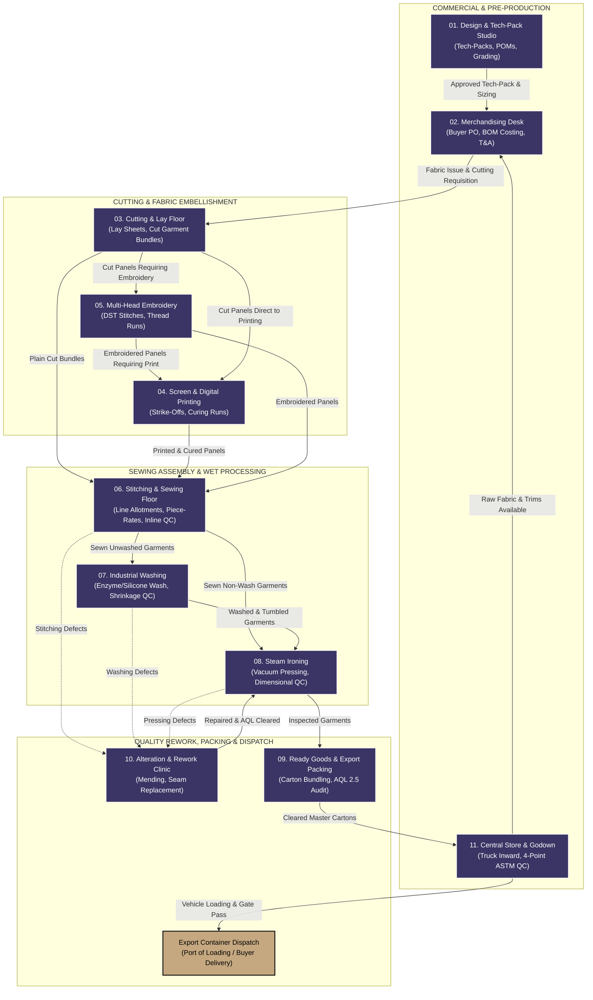

---

# 2. MASTER ENTERPRISE DATA ARCHITECTURE & RELATIONAL HANDSHAKE MODEL

## 2.1 The Golden Thread of Garment Traceability

Every piece of data generated on the shopfloor forms an unbroken relational tree in the PostgreSQL/Supabase database. No floor operator can "invent" an allotment without linking to an approved bundle; no packing supervisor can seal a carton without linking to verified piece counts.

```sql
-- LEVEL 0: MASTER ENTERPRISE ENTITIES
brands (id) ── [1:N] ──➔ vendors (id)
   │                           │
   ├───────────────────────────┼─────────────────────────────┐
   ▼ (brand_id)                ▼ (vendor_id)                 ▼ (brand_id)
-- LEVEL 1: COMMERCIAL CONTRACTS & CHALLANS
merchandising_orders (id)   challans (id)
   │                               │
   ▼ (order_id)                    │
-- LEVEL 2: CUTTING & BUNDLE SEED   │
cutting_lay_sheets (id)             │
   │                               │
   ▼ (lay_sheet_id)                │
cutting_bundles (id) ───────────────┼────────────────────────┐
   │                               │                        │
   ├───────────────────────────────┤                        │
   ▼ (bundle_id)                   ▼ (challan_id)           ▼ (bundle_id)
-- LEVEL 3: SEWING FLOOR ALLOTMENTS   -- LEVEL 4: CARTON PACKING JOIN
allotments (id)                     ready_goods_carton_bundles
   │                                (carton_id, bundle_id, pieces_from_bundle)
   ├───────────────────────────┐                            │
   ▼ (employee_id)             ▼ (allotment_id)             ▼ (carton_id)
employees (id)              qc_logs (id)            ready_goods_cartons (id)
(Lineman Piece-Rate Wages)  (Inline/Endline Audits)         │
                                                            ▼ (carton_id)
                                                    ready_goods_aql_audits (id)
                                                    (inspector_id -> employees.id)
```

## 2.2 Cross-Departmental Information Transmission Protocol

| Transmitting Division | Receiving Division | Transmitted Data Payload | Business Trigger / Handshake Action | Discrepancy / Lockout Rule |
| :--- | :--- | :--- | :--- | :--- |
| **01. Design Studio** | **02. Merchandising** | Style CAD, BOM spec, grading table, approved POMs. | Tech-Pack signed off by Buyer / Head Designer. | Merchandising cannot book a PO without an approved Tech-Pack ID. |
| **02. Merchandising** | **03. Cutting Floor** | Commercial PO, target quantities, fabric allowance, delivery dates. | PO confirmed, buyer Letter of Credit (LC) verified. | Cutting floor cannot spread fabric without a confirmed order ID. |
| **11. Central Store** | **03. Cutting Floor** | Inspected fabric roll barcodes, verified GSM, usable width, roll shrinkage %. | Physical roll issued from Bay 1/2 with ASTM 4-Point inspection tag. | Rolls scoring > 28 defect points/100 sq.m cannot be issued to cutting. |
| **03. Cutting Floor** | **04. Print / 05. Emb** | Physical cut panels with Barcode Bundle Tags (`bundle_id`, piece count, size). | Cutting lay sheet completed, bundles separated and banded. | Embellishment departments cannot begin without scanning the bundle QR. |
| **03 / 04 / 05** | **06. Stitching** | Bundles of cut panels (plain or decorated) matching challan manifests. | Bundle physical delivery to Line Incharge racking bay. | Sewing supervisor cannot create allotment tickets exceeding bundle piece count. |
| **06. Stitching** | **07. Wash / 08. Iron** | 100% Inline/Endline passed garments with Delivery Challan manifest. | Lot passes final line QC inspection; tagged with `Passed Pcs`. | Uninspected or alteration-pending pieces are locked from transit challans. |
| **06 / 07 / 08** | **10. Alteration** | Defective pieces tagged with specific fault code and Lineman/Machine ID. | QC rejects garment during inline, endline, or pressing check. | Alteration clinic tracks rework cost directly against responsible lineman/unit. |
| **10. Alteration** | **08. Steam Ironing** | Repaired garments cleared via Secondary AQL inspection. | Alteration master confirms repair; QC signs off ticket. | Garments cannot rejoin finishing without secondary QC inspector employee ID. |
| **08. Steam Iron** | **09. Packing** | Pressed, measured garments matching tech-pack POM tolerances. | Ironing production log finalized, garments hung or folded. | Garments failing dimensional tolerance are sent back to pressing or alteration. |
| **09. Packing** | **11. Store / Export** | Sealed export master cartons with Barcode Packing Slips & AQL 2.5 Pass Report. | Random AQL audit passes with critical defects = 0. | Failed AQL carton lots are electronically quarantined; gate pass generation is blocked. |

---

# 3. COMPREHENSIVE DIVISION-BY-DIVISION OPERATIONAL BREAKDOWN

---

## DIVISION 00: CENTRAL ENTERPRISE MODULE HUB
* **URL Prefix**: `/modules`
* **Target Users**: Executive Leadership, General Managers, Plant Heads
* **Visual Identity**: `#3A3564` (Indigo Night) with Synchronized Smooth Orbit Animation

### 1. Business Mission & Executive Objectives
The **Central Enterprise Module Hub** provides an instantaneous, bird's-eye cockpit of all 11 operating divisions across the factory. Its business objective is to eliminate departmental silos by presenting plant leaders with real-time throughput metrics, active division states, and synchronized operational status across the entire enterprise.

### 2. Operational Reality & Daily Workflow
Every morning at 08:00 AM, the Plant General Manager and Production Directors open the Module Hub on their touchscreens and executive tablets. Each of the 6 core operational cards displays live running states, active lot counts, and current line bottlenecks. Clicking any portal card launches that division's dedicated cockpit.

### 3. Complete Navigation & Layout Breakdown
* **Card 1: Stitching & Sewing Floor** (`/stitching-sewing/dashboard`): Direct launcher for active progressive sewing lines, lineman allotments, and live TV view.
* **Card 2: Screen & Digital Printing** (`/printing/dashboard`): Direct launcher for screen development, rotary runs, and curing ovens.
* **Card 3: Multi-Head Embroidery** (`/embroidery/dashboard`): Direct launcher for 20-head embroidery machines, DST designs, and thread break tracking.
* **Card 4: Industrial Washing & Wet Processing** (`/washing/dashboard`): Direct launcher for industrial washers, chemical recipes, and shrinkage alerts.
* **Card 5: Master Brands Portfolio** (`/brands`): Directory of principal buyers, international fashion brands, and private label contracts.
* **Card 6: Multi-Vendor Contract Directory** (`/factory`): Complete directory of job-workers, contract stitching units, and trim suppliers.
* **Autonomous Copilot Launcher**: Dedicated access to **Zigza AI Enterprise Assistant** scoped across all divisional databases.

---

## DIVISION 01: DESIGN & TECH-PACK STUDIO
* **URL Prefix**: `/design`
* **Target Users**: Fashion Designers, CAD Pattern Masters, Technical Spec Technicians
* **Upstream Inward**: Buyer Design Brief, Tech-Pack PDF, Moodboard, Physical Swatches
* **Downstream Outward**: Digitally approved Tech-Pack ID, Point of Measure (POM) grading sheets, CAD pattern markers

### 1. Business Mission & Executive Objectives
Garment errors discovered in cutting or stitching cost **100x more** to fix than errors caught in design. The Design Studio's business mission is to create a single, immutable technical source of truth for every garment style, locking down graded measurements, seam specifications, and approved fit samples before bulk fabric is ever unrolled.

### 2. Operational Reality & Daily Workflow
1. Technical designers receive the buyer's sketch or conceptual pack and enter garment specifications into the **Tech-Pack 2-Step Stepper**.
2. Patterns are digitized and Points of Measure (POM) are defined across all standard sizes (XS through 3XL).
3. A physical Pre-Production Sample (PPS) is cut and sewn in the sample room.
4. The fit technician measures the PPS against the digital POM sheet. If measurements are within critical tolerance (e.g. ±0.5 cm), the Tech-Pack is approved. If out of spec, revisions are issued.

### 3. Systematic Process Flowchart

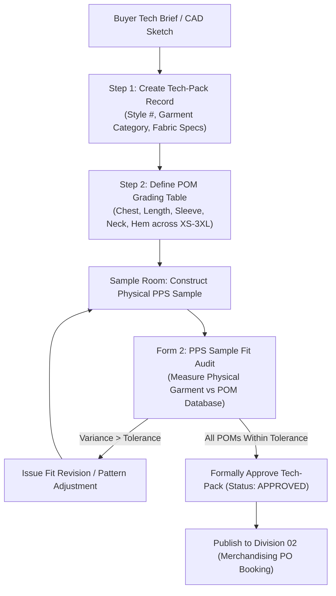

### 4. Complete Menu Navigation Directory (All 7 Views)
1. **Tech-Pack Master Hub** (`/design/tech-packs`): Visual catalog of all active tech-packs with approval badges (`DRAFT`, `SAMPLE_IN_PROGRESS`, `APPROVED`, `REVISED`).
2. **Measurement Points (POM) Library** (`/design/measurements`): Global dictionary of standard measurement points (e.g. Across Shoulder, High Point Shoulder Length, Chest 1" below armhole) ensuring consistent terminology.
3. **Grading Rules & Sizing Curves** (`/design/grading`): Dimensional incremental rules defining how measurements scale from base size (Size M) up to 3XL and down to XS.
4. **CAD Pattern & Marker Vault** (`/design/cad-markers`): Repository of Gerber/Lectra pattern DXF/PLT files linked to specific style versions.
5. **Sample Approvals & PPS Tracking** (`/design/sample-tracker`): Physical sample stage tracking (Proto 1, Fit Sample, Pre-Production Sample, Size Set Sample).
6. **Zigza AI Design Copilot** (`/design/zigza-ai`): AI assistant that calculates fabric consumption from pattern dimensions and audits measurement tables for inconsistencies.
7. **Design Department Profile** (`/design/profile`): Pattern master credentials, digital signature certificates for PPS sign-offs.

---

## DIVISION 02: MERCHANDISING & SOURCING DESK
* **URL Prefix**: `/merchandising`
* **Target Users**: Senior Merchandisers, Sourcing Managers, Costing Accountants
* **Upstream Inward**: Approved Tech-Packs (from Division 01), Fabric/Trim Availability (from Division 11)
* **Downstream Outward**: Commercial POs, BOM Costing Ledgers, T&A Critical Milestones, Sourcing Requisitions (PR)

### 1. Business Mission & Executive Objectives
Merchandising is the commercial heartbeat of the factory. Its mission is to ensure that bulk production is commercially profitable, materials are procured just-in-time, and buyer delivery dates are met without air-freight penalties. It bridges the gap between client purchase orders and factory floor execution.

### 2. Operational Reality & Daily Workflow
1. Merchandisers book incoming buyer POs using the **Master Buyer PO 2-Step Stepper**, entering commercial prices, shipment terms (FOB/CIF), and the detailed Color x Size order matrix.
2. The merchandiser constructs a **BOM Costing Sheet**, itemizing fabric, sewing thread, labels, polybags, CMT (Cut, Make, Trim) rates, and calculating the target profit margin (e.g. 18.5%).
3. A **Time & Action (T&A) Calendar** is auto-generated, locking down strict milestone dates for lab-dip approval, fabric in-house, cutting start, stitching completion, and ex-factory shipping.
4. Material Purchase Requisitions (PRs) are dispatched to vendors for required fabrics and trims.

### 3. Systematic Process Flowchart

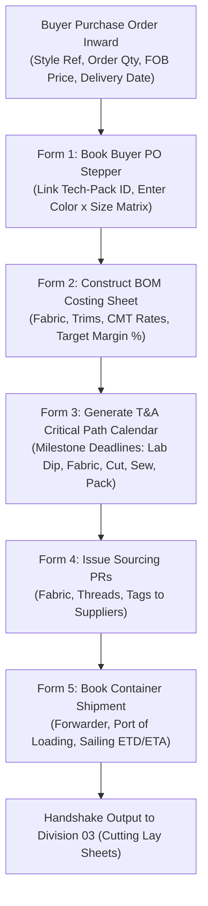

### 4. Complete Menu Navigation Directory (All 8 Views)
1. **Commercial Orders Portfolio** (`/merchandising/orders`): Active buyer POs, order quantities, delivery health indicators, and status badges.
2. **BOM Costing Ledger** (`/merchandising/costing`): Style-by-style cost breakdown comparing budgeted FOB vs actual realized production costs to identify margin erosion.
3. **Time & Action (T&A) Calendar** (`/merchandising/tna-calendar`): Interactive Gantt/calendar tracking critical path milestones; highlights delayed tasks in red.
4. **Material Sourcing & PR Hub** (`/merchandising/sourcing`): Requisition tracker for raw fabrics, sewing threads, zippers, and packaging cartons.
5. **Brand Buyer Directory** (`/merchandising/brands`): Commercial terms, payment terms, and credit limits for registered international buyers.
6. **Export Shipment Bookings** (`/merchandising/shipments`): Container bookings, freight forwarder details, Bill of Lading (B/L) tracking, and customs clearance status.
7. **Zigza AI Merchandising Copilot** (`/merchandising/zigza-ai`): Predictive assistant querying ex-factory delays, fabric price impacts, and container sailing schedules.
8. **Merchandising Desk Profile** (`/merchandising/profile`): Merchandiser portfolio allocations and commercial signing limits.

---

## DIVISION 03: CUTTING & LAY FLOOR
* **URL Prefix**: `/cutting`
* **Target Users**: Cutting Floor Incharge, Spreading Operators, Band-Knife Cutters, Bundle Clerks
* **Upstream Inward**: Commercial PO (from Division 02), Inspected Fabric Rolls (from Division 11)
* **Downstream Outward**: Barcoded Cut Garment Bundles (`cutting_bundles`), Panel QC Audits, End-Bit Remnant Logs

### 1. Business Mission & Executive Objectives
Fabric represents **60% to 70% of the total manufacturing cost** of a garment. The Cutting Floor's mission is to maximize fabric utilization, eliminate cutting defects, and seed the **Zero Ghost Piece Guarantee** by dividing bulk cut plies into individually numbered, barcode-tracked physical bundles.

### 2. Operational Reality & Daily Workflow
1. Spreading operators unroll inspected fabric on long vacuum tables, recording roll numbers, lay plies, and marker lengths on the **Fabric Spreading & Lay Sheet Form**.
2. The lay is cut using automated CNC cutters or straight-knife machines.
3. Quality auditors conduct a **Cut Panel QC Audit**, checking for fraying, notch accuracy, and measurement shrinkage.
4. The **Bundle Ticket Generator** produces unique barcoded bundle tickets. Each ticket encapsulates: Bundle Number, Size, Ply Range (e.g. Pcs 001 to 050), Color, and linked Lay Sheet ID.
5. Remnant fabric ends are weighed and logged in the **End-Bit Remnant Log** to account for every single meter of fabric issued.

### 3. Systematic Process Flowchart

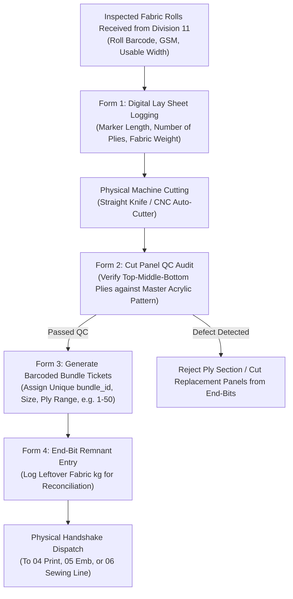

### 4. Complete Menu Navigation Directory (All 8 Views)
1. **Cutting Floor Dashboard** (`/cutting/dashboard`): Daily cut output (pieces cut today), table utilization rates, and pending marker lay requests.
2. **Spreading & Lay Sheets** (`/cutting/lay-sheets`): Repository of all digital lay sheets detailing plies, marker lengths, and fabric roll consumption.
3. **Bundle Generation Hub** (`/cutting/bundles`): Core engine that generates and prints barcode tags for cut garment bundles with unique UUIDs.
4. **Marker Efficiency Library** (`/cutting/markers`): CAD marker efficiency records (percentage of fabric utilized, e.g. 88.4% efficiency vs 11.6% off-cut scrap).
5. **Panel QC Audit Center** (`/cutting/panel-qc`): Inspection records verifying cut panel dimensions against acrylic templates.
6. **End-Bit & Remnant Management** (`/cutting/end-bits`): Tracking short-length fabric remnants (>1m) available for recutting damaged panels.
7. **Zigza AI Cutting Floor Copilot** (`/cutting/zigza-ai`): Smart assistant calculating optimal roll combinations to minimize end-loss scrap.
8. **Cutting Floor Profile** (`/cutting/profile`): Cutting master credentials, table assignments, and shift configurations.

---

## DIVISION 04: SCREEN & DIGITAL PRINTING UNIT
* **URL Prefix**: `/printing`
* **Target Users**: Printing Floor Master, Color Kitchen Chemist, Screen Technicians
* **Upstream Inward**: Plain Cut Panels (from Division 03), Embroidered Panels (from Division 05)
* **Downstream Outward**: Printed, cured, wash-fast panels with zero ink defects dispatched to Sewing (Division 06)

### 1. Business Mission & Executive Objectives
Garment printing adds high aesthetic value but carries high scrap risk: an uncured pigment or misaligned screen ruins the cut panel permanently. The Printing Unit's mission is to achieve 100% color strike-off fidelity, absolute wash-fastness, and prevent defective panels from contaminating downstream sewing lines.

### 2. Operational Reality & Daily Workflow
1. The color kitchen develops ink formulations (Plastisol, Waterbase, Discharge, Silicone).
2. The technician produces a sample panel and submits it via the **Pre-Production Strike-Off Approval Form**. The buyer/QA approves shade and hand-feel.
3. Bulk cut bundles arrive from Cutting. Operators scan the bundle barcode.
4. Machine runs are executed across automatic oval or manual rotary print tables.
5. Panels pass through the infrared curing tunnel (160°C for 2.5 minutes).
6. The shift inspector enters data into the **Shift Production & Rejection Form**, separating passed pieces from misprints.

### 3. Systematic Process Flowchart

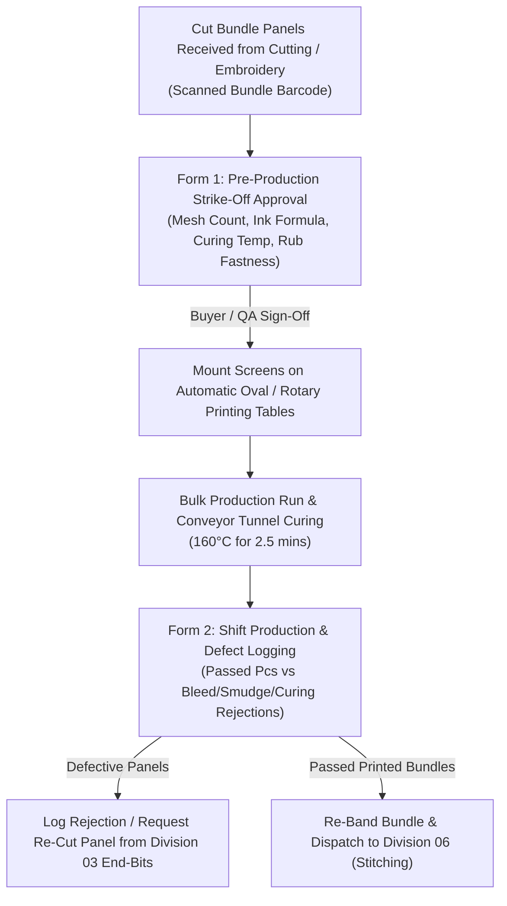

### 4. Complete Menu Navigation Directory (All 8 Views)
1. **Printing Master Dashboard** (`/printing/dashboard`): Daily impressions printed, machine runtime efficiency, and active strike-off status.
2. **Strike-Off Approvals** (`/printing/strike-offs`): History of lab swatches, Pantone color codes, and digital approvals.
3. **Screen & Mesh Registry** (`/printing/screens`): Inventory of exposed screens, mesh tensions (Newtons/cm), and emulsion types.
4. **Color Kitchen & Ink Formulations** (`/printing/color-kitchen`): Recipes for specialty inks (high-density, puff, reflective, glitter).
5. **Curing Oven & Temperature Telemetry** (`/printing/curing`): Temperature logs ensuring every lot reaches required cross-linking temperature.
6. **Print Rejection & Defect Analysis** (`/printing/rejections`): Defect Pareto tracking (e.g. pinholes, misregistration, crocking).
7. **Zigza AI Printing Copilot** (`/printing/zigza-ai`): AI assistant providing ink curing parameter recommendations based on fabric fiber composition.
8. **Printing Floor Profile** (`/printing/profile`): Printing master credentials and table maintenance logs.

---

## DIVISION 05: MULTI-HEAD EMBROIDERY FLOOR
* **URL Prefix**: `/embroidery`
* **Target Users**: Embroidery Floor Supervisor, Punching / Digitizing Master, Machine Operators
* **Upstream Inward**: Plain Cut Panels (from Division 03)
* **Downstream Outward**: Precision-stitched embroidered panels dispatched to Printing (Division 04) or Stitching (Division 06)

### 1. Business Mission & Executive Objectives
Embroidery machines operate at 800 to 1,000 stitches per minute with up to 20 heads running simultaneously. The Embroidery Floor's mission is to execute intricate embroidery designs without thread breakage downtime, puckering, or needle puncture holes that weaken fabric integrity.

### 2. Operational Reality & Daily Workflow
1. The digitizer converts buyer graphic art into machine DST/EMB code, logging stitch count, color sequence, and backing stabilizer type on the **DST Design Program Form**.
2. Cut panel bundles arrive from Cutting.
3. Framing operators hoop panels with tear-away or cut-away backing stabilizer.
4. The supervisor logs the machine run using the **Shift Machine Run Form**, tracking head speeds and thread breakage frequencies.
5. Finished panels undergo trim inspection to clip jump threads before bundle re-banding.

### 3. Systematic Process Flowchart

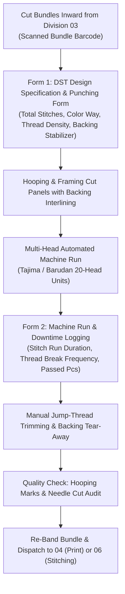

### 4. Complete Menu Navigation Directory (All 8 Views)
1. **Embroidery Floor Dashboard** (`/embroidery/dashboard`): Real-time machine status (running, thread break, stopped), total stitch count realized, and active job orders.
2. **DST Design & Program Vault** (`/embroidery/designs`): Repository of machine stitch files with preview vectors, stitch counts, and color stop sequences.
3. **Machine Fleet Monitor** (`/embroidery/machines`): Individual telemetry for all multi-head machines (speed, oiling cycle, needle changes).
4. **Thread & Stabilizer Godown** (`/embroidery/thread-store`): Inventory of polyester/viscose embroidery cones, metallic threads, and fusible backings.
5. **Appliqué & Laser Cutting Desk** (`/embroidery/applique`): Preparation station for appliqué fabric patches stitched into designs.
6. **Embroidery Defect Pareto** (`/embroidery/defects`): Tracking bird-nesting, registration shifting, and skipped stitches.
7. **Zigza AI Embroidery Copilot** (`/embroidery/zigza-ai`): Assistant estimating run durations based on machine head speeds and stitch counts.
8. **Embroidery Floor Profile** (`/embroidery/profile`): Embroidery master credentials and technician assignments.

---

## DIVISION 06: STITCHING & SEWING FLOOR (THE BENCHMARK CORE)
* **URL Prefix**: `/stitching-sewing`
* **Target Users**: Floor Supervisors, Progressive Line Incharges, Linemen, QC Auditors, Store Incharge
* **Upstream Inward**: Verified cut/printed/embroidered bundles (`bundle_id`), Delivery Challans (`challan_no`), Thread cones/trims
* **Downstream Outward**: 100% QC Passed stitched garments moving to Washing (07) or Ironing (08); Defective pieces to Alteration (10)

### 1. Business Mission & Executive Objectives
The **Stitching & Sewing Floor** is the core operational benchmark of the Zigza MES ecosystem. It governs the physical assembly of cut panels into complete garments across progressive lines. Its mission is to achieve **high line balancing efficiency (OEE ≥ 85%)**, enforce **Zero Wage Disputes** through bundle-bound piece-rate ledgers, and maintain strict **First-Pass Yield (FPY ≥ 97.5%)**.

### 2. Operational Reality & Daily Workflow
1. The floor supervisor receives cut bundles and creates lineman target tickets using the **Daily Target Allotment Form**, legally binding the allotment to `bundle_id` and `employee_id`.
2. Database triggers prevent allotment quantities from exceeding the bundle's cut piece count.
3. Operators stitch seams progressively (front rise, back rise, inseam, waistband, overlock).
4. Inline and End-of-Line QC inspectors inspect 100% of garments at the end of the line, recording results on the digital **QC Inspection Terminal**:
   * Passed garments are tagged for transit.
   * Defective garments (puckering, skip stitch) generate an automatic **Alteration Ticket** sent to Division 10.
5. Verified passed pieces generate the lineman's piece-rate wage entry:
   $$\text{Shift Wage} = \text{Verified Passed Pcs} \times \text{Article Stitching Rate}$$
6. At shift end, passed lots are bundled with an outward Delivery Challan for washing or ironing.

### 3. Systematic Process Flowchart

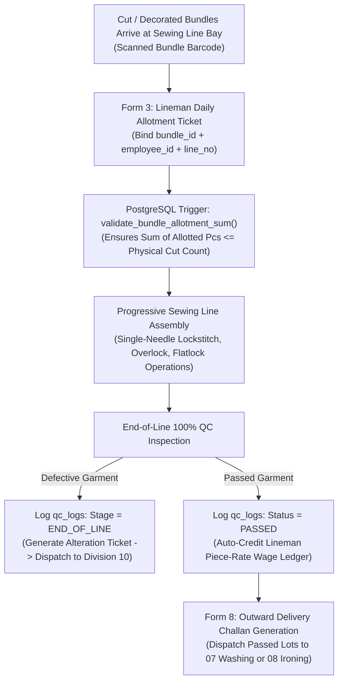

### 4. Complete Menu Navigation Directory (All 13 Views - Master Benchmark)
1. **Central Enterprise Hub** (`/modules`): Global enterprise launchpad linking all 11 divisions.
2. **Master Floor Dashboard** (`/stitching-sewing/dashboard`): Real-time line velocity, active operator counts, First-Pass Yield %, and fullscreen **TV View Mode** for overhead shopfloor monitors.
3. **Store & Godown Receiving** (`/stitching-sewing/store`): 5-tab inward portal managing Truck GRN, accessory issues, active floor handshakes, and damaged fabric reissues.
4. **Dedicated Sewing AI Copilot** (`/stitching-sewing/zigza-ai`): Scoped AI querying hourly line throughput, lineman wage calculations, and open challan aging.
5. **Production Chart & Orders Hub** (`/stitching-sewing/production-orders`): Delivery Challan management with Brand + Vendor dual filters and Excel bulk import parser.
6. **Target Allotments & Bundle Binding** (`/stitching-sewing/allotments`): Individual operator piece-rate tickets bound to `cutting_bundles.id` and `employees.id`.
7. **Godown & WIP Inventory** (`/stitching-sewing/inventory`): Live floor balance tracking pieces active on lines vs ready pieces in staging bays.
8. **Dispatch & Challan Gate Passes** (`/stitching-sewing/dispatch`): Outward logistics engine generating printable Delivery Challans with QR signatures.
9. **Supervisor Shift Profile** (`/stitching-sewing/profile`): Floor supervisor credentials, line balance configurations, and digital sign-off records.
10. **Brands & Multi-Vendor Directory** (`/stitching-sewing/vendors`): Multi-tier registry separating Principal Buyers (Form 7A) from Contract Job-Workers (Form 7B).
11. **Floor Employees & Linemen Registry** (`/stitching-sewing/employees`): Master employee directory with skill grades, role classifications, and verified piece-rates.
12. **Articles & Style Catalog** (`/stitching-sewing/articles`): Garment style repository defining article numbers, SAM (Standard Allowed Minutes), and stitching rates.
13. **Reports & Audit Analytics** (`/stitching-sewing/reports`): Production export ledgers, daily wage payouts, and rejection Pareto charts.

---

## DIVISION 07: INDUSTRIAL WASHING & WET PROCESSING
* **URL Prefix**: `/washing`
* **Target Users**: Washing Floor Master, Laundry Chemical Technician, Wet Processing Operators
* **Upstream Inward**: Stitched raw garments (`challan_no`, style, color) from Division 06
* **Downstream Outward**: Washed, softened, tumble-dried garments with stable dimensional shrinkage dispatched to Ironing (Division 08)

### 1. Business Mission & Executive Objectives
Garments made from denim, heavy twill, or circular knits cannot be worn in their raw stitched state. The Washing Division's mission is to impart desired aesthetic hand-feel (enzyme wash, silicone softening, vintage tinting) while **stabilizing dimensional shrinkage** so the garment maintains exact tech-pack specifications after domestic laundering.

### 2. Operational Reality & Daily Workflow
1. Stitched lots arrive from Sewing and are logged into industrial washing machines (250kg - 500kg capacity).
2. The technician executes the digital recipe via the **Washing Batch Run Form** (water volume, chemical dosage, liquor ratio, bath temperature, cycle time).
3. The lot moves to hydro-extractors (centrifugal water removal) and industrial gas tumble dryers.
4. Quality auditors test random sample pieces for dimensional shrinkage using the **Shrinkage & Shade QC Form**.
5. If shrinkage exceeds tech-pack allowance (e.g. > 3.0%), an immediate **Shrinkage Alert** is broadcast to Cutting and Merchandising to adjust upstream pattern sizing.

### 3. Systematic Process Flowchart

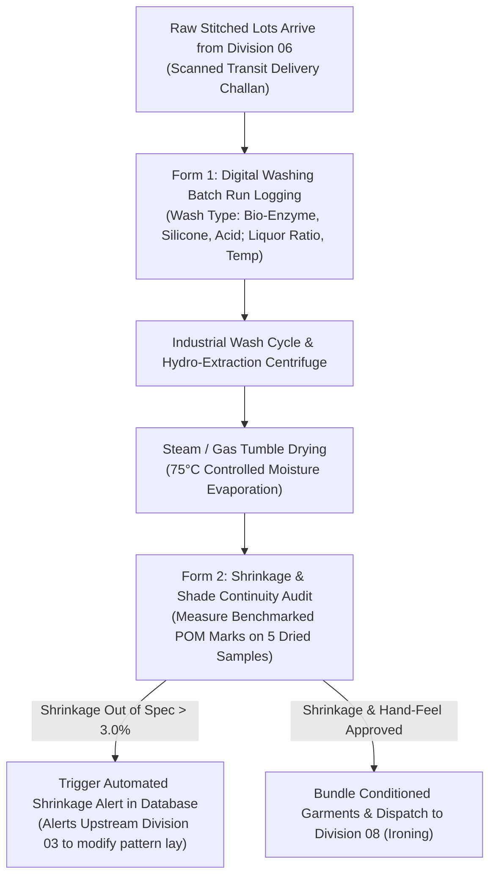

### 4. Complete Menu Navigation Directory (All 8 Views)
1. **Washing Floor Dashboard** (`/washing/dashboard`): Active drum loads, daily washer throughput (kg and pieces processed), and boiler steam pressure telemetry.
2. **Batch Run Ledger** (`/washing/batches`): Master registry of all wash loads, active cycles, and linked challans.
3. **Chemical Recipe Vault** (`/washing/recipes`): Proprietary laundry formulas (cellulase enzymes, non-ionic softeners, optical brighteners).
4. **Shrinkage & Shade QC Portal** (`/washing/shrinkage-qc`): Laboratory measurement logs recording pre-wash vs post-wash dimensions.
5. **Hydro & Dryer Telemetry** (`/washing/dryers`): Moisture meter readings and exhaust temperature tracking.
6. **Effluent Treatment (ETP) Monitor** (`/washing/etp`): Environmental compliance tracking (pH levels, chemical oxygen demand, water recycling metrics).
7. **Zigza AI Washing Copilot** (`/washing/zigza-ai`): AI providing chemical dosage corrections based on raw fabric test reports.
8. **Washing Department Profile** (`/washing/profile`): Laundry chemist certifications and environmental compliance audit records.

---

## DIVISION 08: STEAM IRONING & PRESSING FLOOR
* **URL Prefix**: `/iron`
* **Target Users**: Finishing Incharge, Vacuum Ironing Operators, Form-Finisher Pressers
* **Upstream Inward**: Washed garments (from Division 07) or unwashed woven garments (from Division 06)
* **Downstream Outward**: Wrinkle-free, dimensionally calibrated, thread-trimmed garments ready for Export Packing (Division 09)

### 1. Business Mission & Executive Objectives
Steam ironing is the critical aesthetic finishing stage where garments receive their final retail presentation. The Ironing Floor's mission is to remove all wrinkles, set sharp creases where specified, verify final garment dimensions against tech-pack POMs, and ensure zero iron shine or scorch marks reach packaging.

### 2. Operational Reality & Daily Workflow
1. Garments arrive from Washing or Sewing.
2. Supervisors assign operators to industrial vacuum steam tables using the **Table Allotment & Daily Pressing Form**.
3. Pressers steam and shape the garment at 140°C with instant vacuum suction to cool and set the fibers.
4. Finishing inspectors audit pressed pieces on the **Shift Pressing & Defect Form**:
   * Pieces passing visual and dimensional inspection move immediately to Packing.
   * Pieces with water stains or iron scorch marks are routed to Alteration (Division 10) for specialized stain removal.

### 3. Systematic Process Flowchart

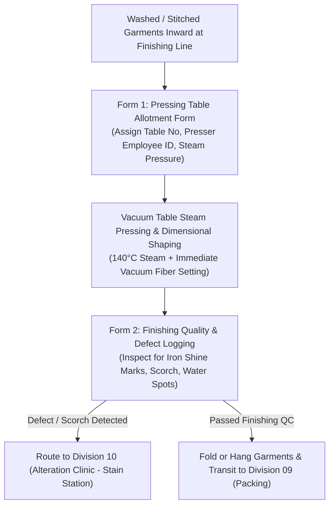

### 4. Complete Menu Navigation Directory (All 8 Views)
1. **Ironing Floor Dashboard** (`/iron/dashboard`): Daily pieces pressed, active pressing tables, operator productivity rates, and boiler steam pressure status.
2. **Pressing Tables Ledger** (`/iron/tables`): Individual table tracking (operator name, active style, hourly pieces pressed).
3. **Steam Boiler & Utility Telemetry** (`/iron/boiler`): Steam pressure telemetry (5.5 Bar operating pressure) and water treatment status.
4. **Finishing Dimension Audit** (`/iron/dimensions`): Random dimensional verification testing chest, length, and waist tolerances before packing.
5. **Specialty Form-Finisher Hub** (`/iron/form-finishers`): Tracking automated jacket/trouser dummy form finishers for tailored styles.
6. **Finishing Defect Analysis** (`/iron/defects`): Tracking steam water spots, iron burn marks, and improper creasing.
7. **Zigza AI Ironing Copilot** (`/iron/zigza-ai`): Assistant optimizing table temperature and press duration by fabric blend.
8. **Ironing Department Profile** (`/iron/profile`): Finishing master credentials and equipment maintenance logs.

---

## DIVISION 09: READY GOODS & EXPORT PACKING
* **URL Prefix**: `/ready-goods`
* **Target Users**: Packing Master, Barcode Scanning Operators, Quality Assurance Auditors
* **Upstream Inward**: Finished pressed garments (from Division 08)
* **Downstream Outward**: Sealed master export cartons (`ready_goods_cartons`), Barcode Packing Slips, Certified AQL 2.5 Audit Reports

### 1. Business Mission & Executive Objectives
Export packing is the **final legal gate of the factory**. Once a master carton is taped, palletized, and sealed, any defect inside is a direct commercial liability. The Packing Division's mission is to ensure **100% carton packing accuracy**, enforce carton piece count ceilings via database triggers, and certify shipment compliance through **AQL 2.5 Quality Audits**.

### 2. Operational Reality & Daily Workflow
1. Pressed garments are tagged with retail price tickets, folded, and polybagged.
2. Packers pack garments into heavy-duty corrugated cartons using the **Carton Packing & Bundle Verification Form**.
3. Database triggers ensure that total pieces packed from a bundle across cartons cannot exceed the bundle's cut piece count.
4. The factory QA Auditor executes an **AQL 2.5 Audit** using the **AQL 2.5 Random Carton Inspection Form**:
   * A statistically determined sample of cartons is opened (e.g. 20 cartons out of 200).
   * Garments are inspected for critical, major, and minor defects.
   * If defects are within AQL 2.5 acceptance thresholds, the lot status transitions to `AQL_AUDIT_PASSED`.
   * If defects exceed acceptance limits, an automated trigger locks the lot to `QUARANTINED_AQL_FAILED`, physically prohibiting gate pass generation.

### 3. Systematic Process Flowchart

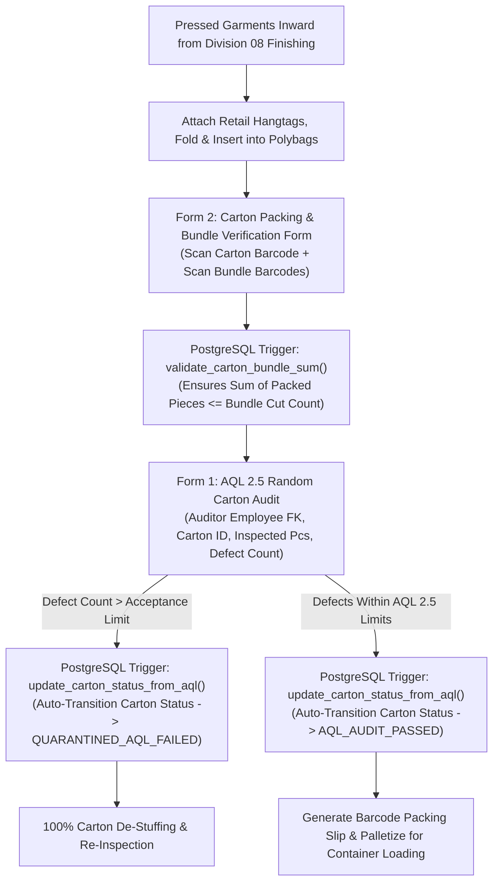

### 4. Complete Menu Navigation Directory (All 8 Views)
1. **Packing Floor Dashboard** (`/ready-goods/dashboard`): Cartons packed today, total pieces boxed, AQL audit pass rate %, and pending export orders.
2. **Master Carton Registry** (`/ready-goods/cartons`): Complete directory of all master cartons, linked POs, gross/net weights, and CBM dimensions.
3. **AQL 2.5 Quality Audits** (`/ready-goods/aql-audits`): Formal audit registry detailing inspector employee IDs, sample sizes, and defect thresholds.
4. **Barcode Label Generator** (`/ready-goods/barcodes`): Print engine for GS1-128 shipping carton labels and polybag UPC barcodes.
5. **Palletization & Container Manifest** (`/ready-goods/pallets`): Pallet stacking planner optimizing 20ft and 40ft High Cube container stuffing.
6. **Packing Material Store** (`/ready-goods/supplies`): Inventory of master cartons, polybags, silica gel desiccant packs, and gum tape.
7. **Zigza AI Packing Copilot** (`/ready-goods/zigza-ai`): Predictive assistant auditing carton dimensional weights and calculating container cube utilization.
8. **Packing Floor Profile** (`/ready-goods/profile`): Packing incharge credentials and compliance officer certifications.

---

## DIVISION 10: ALTERATION & QUALITY REWORK CLINIC
* **URL Prefix**: `/alter`
* **Target Users**: Quality Mending Incharge, Alteration Tailors, Defect Analytics Officers
* **Upstream Inward**: Defective garments rejected during Sewing (06), Washing (07), or Ironing (08)
* **Downstream Outward**: Certified repaired garments cleared via Secondary AQL Inspection returning to Finishing (08); Unfixable scrap logged for accounting

### 1. Business Mission & Executive Objectives
Every factory produces defective garments; the difference between a profitable factory and an unprofitable one is **how efficiently defects are mended**. The Alteration Clinic's mission is to salvage reworkable garments, eliminate recurrent line defects through operator root-cause tracking, and ensure that no substandard piece is hidden or discarded without documentation.

### 2. Operational Reality & Daily Workflow
1. When an inspector in Sewing, Washing, or Ironing flags a defect, the system generates an Alteration Ticket.
2. The garment is physically delivered to the Alteration Clinic staging bin.
3. The mending supervisor logs the intake using the **Defect Intake & Triage Form**, identifying the defect type (broken seam, puckering, spot) and linking it to the responsible Lineman Employee ID.
4. A skilled master tailor repairs the garment (re-stitching, replacing damaged panel).
5. The secondary QC auditor inspects the repaired garment using the **Repair Resolution & Secondary AQL Clearance Form**:
   * If the repair is flawless, the garment is cleared and returns to Ironing (Division 08).
   * If irreparable, it is condemned to **Final Condemned Scrap**, closing the piece count ledger with full accounting transparency.

### 3. Systematic Process Flowchart

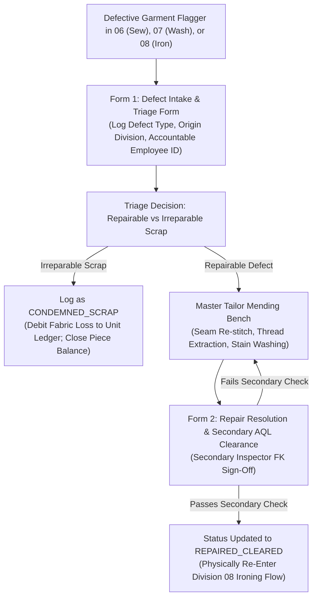

### 4. Complete Menu Navigation Directory (All 8 Views)
1. **Alteration Clinic Dashboard** (`/alter/dashboard`): Active defect tickets, daily repair throughput, rework resolution rate %, and scrap loss percentage.
2. **Defect Intake & Active Tickets** (`/alter/tickets`): Live queue of all garments currently undergoing repair, filtered by department of origin.
3. **Operator Defect Scorecard** (`/alter/operators`): Performance ranking highlighting operators with high defect rates for retraining.
4. **Stain Removal & Chemical Bench** (`/alter/spotting`): Specialized station using ultrasonic spot guns and chemical agents to remove oil/rust stains.
5. **Condemned Scrap Ledger** (`/alter/scrap`): Official write-off registry of unfixable garments, audited by finance for fabric reconciliation.
6. **Root-Cause Pareto Analytics** (`/alter/analytics`): Statistical defect charts (e.g. 42% skipped stitches, 28% oil spots, 18% puckering).
7. **Zigza AI Quality Clinic Copilot** (`/alter/zigza-ai`): AI analyzing defect cluster patterns and alerting supervisors to dull cutting blades or machine timing issues.
8. **Quality Clinic Profile** (`/alter/profile`): Master tailor credentials and quality assurance audit privileges.

---

## DIVISION 11: CENTRAL STORE & RAW MATERIAL GODOWN
* **URL Prefix**: `/store`
* **Target Users**: Chief Storekeeper, Godown Incharge, Fabric Roll Inspectors, Material Issue Clerks
* **Upstream Inward**: Bulk Fabric Mills (Truck Inwards), Trims & Accessories Suppliers, Cleared Master Cartons (09)
* **Downstream Outward**: Certified Fabric Rolls to Cutting (03), Accessories to Sewing (06), Master Cartons to Export Container Loading

### 1. Business Mission & Executive Objectives
The Central Store is the physical custodian of all company assets. It controls **Bay 1 & 2 (Raw Materials Godown)** and **Bay 3–5 (Finished Goods Ready for Export)**. Its mission is to prevent inventory leakage, verify that incoming raw materials meet ASTM 4-Point quality standards before cutting, and execute synchronized final export dispatches.

### 2. Operational Reality & Daily Workflow
1. Trucks arrive at the factory gate. The storekeeper logs incoming goods via the **Truck Gate Inward (GRN) 3-Step Stepper**, capturing transport slips, supplier names, roll counts, and initial weights.
2. Fabric rolls are moved to the inspection bay. Certified fabric inspectors run rolls across lighted inspection frames, executing the **ASTM 4-Point Roll Inspection Form**. Rolls scoring > 28 penalty points per 100 sq.m are tagged `REJECTED` and quarantined.
3. Passed rolls receive unique barcode roll IDs and are slotted into automated godown racks.
4. When Cutting or Sewing requests materials, the store issues goods via the **Material Issue Handshake Form**, requiring supervisor digital sign-off.
5. In Bay 3–5, cleared master cartons from Division 09 are marshaled and loaded into shipping containers against the commercial shipping manifest.

### 3. Systematic Process Flowchart

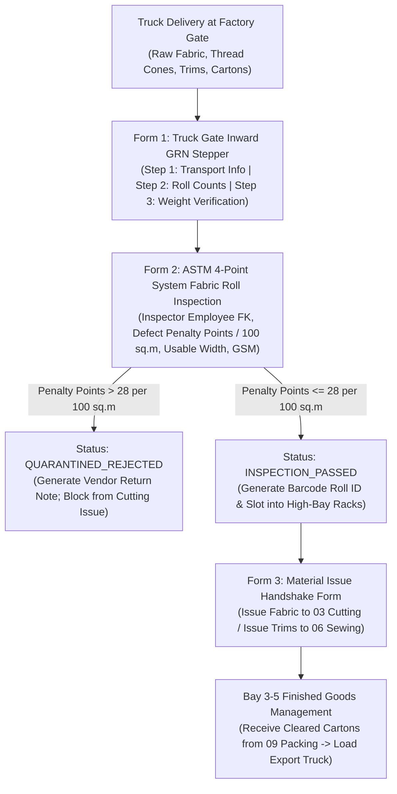

### 4. Complete Menu Navigation Directory (All 8 Views)
1. **Central Store Dashboard** (`/store/dashboard`): Total raw fabric in stock (kg and meters), active truck GRNs pending, daily material issues, and export pallet status.
2. **Fabric Rolls Master Registry** (`/store/fabric-rolls`): Inventory of all physical rolls with barcode IDs, dye lot numbers, verified GSM, and usable width.
3. **ASTM 4-Point Inspection Center** (`/store/inspection`): Formal quality laboratory records certifying incoming fabric roll quality.
4. **Trims & Accessories Godown** (`/store/trims`): Stock records for sewing threads, zippers, buttons, woven main labels, and care tags.
5. **Material Requisitions & Handovers** (`/store/issues`): Digital sign-off log for raw materials issued to shopfloor production lines.
6. **Finished Goods Bay 3–5 Hub** (`/store/finished-goods`): Staging warehouse holding palletized export cartons awaiting container arrival.
7. **Zigza AI Central Store Copilot** (`/store/zigza-ai`): AI predicting stock replenishment re-order points based on active production line velocity.
8. **Central Store Profile** (`/store/profile`): Chief storekeeper credentials, gate pass authorization keys, and annual stocktaking records.

---

# 4. THE ALTERATION, REJECTION & QUARANTINE CLOSED-LOOP CIRCUIT

## 4.1 Defect Classification & Escalation Matrix

When defects occur during manufacturing, the system categorizes them into three strict severity tiers with automated database enforcement:

| Defect Tier | Examples | Department Detected | Operational & Database Action | Escalation Protocol |
| :--- | :--- | :--- | :--- | :--- |
| **Tier 1: Minor / Reworkable** | Skipped stitch, loose thread tension, wavy hem, removable chalk/oil spot. | 06 Sewing, 08 Ironing | Garment routed to **Division 10 (Alteration Clinic)**. Original lineman's wage credit remains pending until repair is certified. | Mended by alteration tailor; re-inspected by secondary QC auditor. |
| **Tier 2: Critical / Component Failure** | Cut panel tear, needle burn hole, permanent pigment smudge, out-of-tolerance shrinkage (>4%). | 03 Cutting, 04 Printing, 07 Washing | Panel condemned. System issues recut authorization to **Division 03 End-Bits Store**. Cost debited to responsible unit. | If defective lot exceeds 3.0% of order, line is paused and Department Head alerted. |
| **Tier 3: Fatal / Batch Quarantine** | AQL 2.5 carton audit failure, broken needle piece embedded in garment (metal detector fail). | 09 Packing (AQL Gate) | Entire shipment lot (e.g. 500 cartons) is locked via trigger `update_carton_status_from_aql()` to `QUARANTINED_AQL_FAILED`. | Hard database block prevents generation of outward Gate Passes. Plant Head sign-off required. |

---

## 4.2 Re-Work Handshake & Secondary AQL Clearance Flowchart

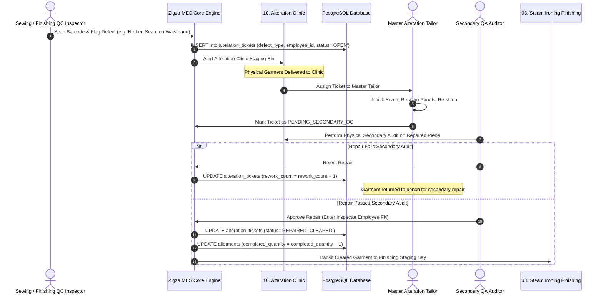

---

# 5. FINANCIAL RECONCILIATION, COMMERCIAL BILLING & WAGE LEDGER ENGINE

## 5.1 Lineman Piece-Rate Wage Calculation & Zero-Dispute Formula

In traditional apparel manufacturing, operators claim output based on physical counters or memory, resulting in payroll disputes. Under **Zigza MES**, piece-rate wage calculation is 100% automated and legally bound to QC-verified completions:

$$\text{Operator Daily Wage (₹)} = \sum_{i=1}^{n} \left( \text{Verified Passed Pieces}_{i} \times \text{Approved Article Piece Rate (₹)}_{i} \right)$$

```
                                  WAGE CALCULATION RULES
   1. Allotments are strictly capped by cutting_bundles.piece_count via PostgreSQL trigger.
   2. Wages are credited ONLY when qc_logs record status = 'PASSED'.
   3. Pending alteration garments hold wage credits in escrow until Division 10 sign-off.
   4. Irreparable scrap garments result in zero piece-rate credit.
```

At 06:00 PM shift end, the payroll accountant clicks **"Generate Daily Wage Ledger"** in `/stitching-sewing/reports`. The ledger displays operator employee codes, verified passed garments, approved piece rates, and net earned wages with zero opportunity for manual manipulation.

---

## 5.2 Vendor Sub-Contract Settlement & Shortage Penalty Ledger

When contracting production lots to external job-workers (stitching units or printing houses), payment is governed by the **QC-Verified Payout Formula**:

$$\text{Net Vendor Payout (₹)} = \left( \text{QC Passed Units Received} \times \text{Contract CM Rate} \right) - \left( \text{Shortage Pieces} \times \text{Fabric Penalty Cost per Piece} \right)$$

### Real-World Settlement Example:
* **Vendor Unit**: `Shanti Garments (VND-SHANTI-01)`
* **Production Order**: Challan #JOB-457 (Brand: `OLLYPOP`)
* **Cut Pieces Issued by Store**: `3,000 Pcs`
* **Stitched Pieces Received**: `2,950 Pcs` *(50 Pieces Physical Shortage)*
* **QC Inspection Audit**: `2,900 Passed` | `50 Irreparable Alteration Defects`
* **Contract Stitching Rate**: `₹20.00 / Piece`
* **Fabric Value per Piece**: `₹120.00 / Piece`

$$\text{Gross Stitching Earned} = 2,900 \text{ Passed Pcs} \times ₹20.00 = ₹58,000$$
$$\text{Shortage & Scrap Penalty} = (50 \text{ Short} + 50 \text{ Scrap}) \times ₹120.00 = ₹12,000$$
$$\mathbf{\text{Net Approved Vendor Payout}} = ₹58,000 - ₹12,000 = \mathbf{₹46,000.00}$$

The system automatically generates the vendor settlement voucher, deducting unreturned fabric costs directly from the payout check.

---

## 5.3 BOM Costing Realization & Fabric Consumption Variance

At commercial closure of an export order, the finance desk executes the **BOM Realization Audit**:

$$\text{Fabric Consumption Variance (\%)} = \left( \frac{\text{Actual Fabric Consumed (kg)} - \text{Budgeted BOM Fabric (kg)}}{\text{Budgeted BOM Fabric (kg)}} \right) \times 100$$

* **Positive Variance (+3.5%)**: Factory consumed 3.5% more fabric than quoted to the buyer. Merchandising reviews lay efficiency in Division 03 to identify marker loss.
* **Negative Variance (-2.1%)**: Factory achieved 2.1% fabric saving through CAD optimization. The monetary savings (e.g. ₹1,85,000) are credited directly to net operational margin.

---

# 6. EXECUTIVE GOVERNANCE & SENIOR MANAGEMENT SIGN-OFF

### Enterprise Portal Directory Summary Across All 11 Divisions

| Division Reference | Division Name | Primary Route | Menu Items | Primary Database Tables | Key Operational Risk Mitigated |
| :--- | :--- | :--- | :--- | :--- | :--- |
| **Division 00** | **Central Enterprise Module Hub** | `/modules` | 6 Cards + Copilot | Dynamic App Router | Departmental isolation & operational blindspots. |
| **Division 01** | **Design & Tech-Pack Studio** | `/design` | 7 Views | `design_tech_packs`, `design_poms`, `design_measurement_values` | Pre-production sizing errors & bulk cutting mismatch. |
| **Division 02** | **Merchandising & Sourcing Desk** | `/merchandising` | 8 Views | `merchandising_orders`, `merchandising_bom_costings`, `merchandising_tna_milestones`, `merchandising_shipments` | Commercial margin erosion & export shipping delays. |
| **Division 03** | **Cutting & Lay Floor** | `/cutting` | 8 Views | `cutting_lay_sheets`, `cutting_bundles`, `cutting_panel_qc_audits`, `cutting_end_bit_logs` | Fabric off-cut waste & untracked "ghost piece" generation. |
| **Division 04** | **Screen & Digital Printing Unit** | `/printing` | 8 Views | `printing_production_runs` | Ink wash-out bleeding, screen misregistration & panel scrap. |
| **Division 05** | **Multi-Head Embroidery Floor** | `/embroidery` | 8 Views | `embroidery_designs`, `embroidery_machine_runs` | Thread breakage downtime & needle puncture fabric damage. |
| **Division 06** | **Stitching & Sewing Floor (Core)** | `/stitching-sewing` | 13 Views | `brands`, `vendors`, `employees`, `articles`, `challans`, `allotments`, `qc_logs`, `store_transactions` | Lineman wage inflation & uninspected garment flow. |
| **Division 07** | **Industrial Washing & Wet Processing**| `/washing` | 8 Views | `washing_batches`, `washing_shrinkage_alerts` | Customer sizing rejections caused by fabric shrinkage. |
| **Division 08** | **Steam Ironing & Pressing Floor** | `/iron` | 8 Views | `iron_production_logs` | Scorched retail garments & uncalibrated dimensions. |
| **Division 09** | **Ready Goods & Export Packing** | `/ready-goods` | 8 Views | `ready_goods_cartons`, `ready_goods_carton_bundles`, `ready_goods_aql_audits` | Missing pieces inside cartons & buyer AQL chargebacks. |
| **Division 10** | **Alteration & Quality Rework Clinic** | `/alter` | 8 Views | `alteration_tickets` | Scrap concealment & unrecovered rework costs. |
| **Division 11** | **Central Store & Raw Material Godown**| `/store` | 8 Views | `store_fabric_rolls` | Substandard fabric roll cutting & inventory shrinkage. |

---

