# ZIGZA ENTERPRISE MES
## Master Business Logic & End-to-End Operations Manual

---

**Document Control Reference:** `ZIGZA-MES-SOP-2026-V2`
**Classification:** Proprietary Enterprise Business Logic & Technical Architecture
**Target Audience:** Board of Directors, Managing Directors, Factory Operations Heads, Chief Financial Officers, Quality Assurance Directors, IT Engineering Leads
**Operating Platform:** Zigza Enterprise Web Admin & Connected Mobile MES Applications
**Prepared For:** Senior Management Review

| Version | Date | Summary of Change |
|---|---|---|
| V1 | — | Initial division-by-division architecture and business logic draft |
| V2 | Current | Reconciled all menu routes against the frozen engineering specification (`docs_portals/01–11`); added glossary, quantified business impact summary, and formal governance sign-off block |

---

## Purpose of This Document

This manual is the single business-logic reference for the Zigza Manufacturing Execution System (MES). It exists to answer four questions for anyone reading it, from a machine operator's supervisor to a board member:

1. **What is each division of the factory floor responsible for, in plain business terms — not just technical terms?**
2. **What screens and tools does each division actually use day to day, and what does each one do?**
3. **What information moves from one division to the next, and what rule stops bad data from moving forward?**
4. **What does this system protect the business from, in rupees, in disputes, and in buyer relationships?**

Every diagram, table, and worked example in this document reflects the same information architecture as the underlying engineering specification. Nothing here is aspirational or simplified for presentation purposes — this is what the system does.

---

## TABLE OF CONTENTS

1. Executive Summary & Strategic Vision
2. Glossary of Industry & Technical Terms
3. Master Enterprise Data Architecture & Relational Handshake Model
4. Comprehensive Division-by-Division Operational Breakdown (Divisions 00–11)
5. The Alteration, Rejection & Quarantine Closed-Loop Circuit
6. Financial Reconciliation, Commercial Billing & Wage Ledger Engine
7. Quantified Business Impact & Return on Investment
8. Phased Implementation Roadmap
9. Executive Governance & Senior Management Sign-Off
10. Appendix: Consolidated Navigation & Data Reference Table

---

# 1. EXECUTIVE SUMMARY & STRATEGIC VISION

## 1.1 The Apparel Manufacturing Paradox — The Cost of Operational Blindspots

Every garment factory of meaningful scale runs on the same four unresolved risks, regardless of how experienced its management is:

**Ghost pieces and inventory shrinkage.** Fabric is cut for 10,000 garments. Only 9,540 are packed into shipping cartons. Where did the other 460 go? Were they damaged in printing? Lost between departments? Miscounted? Stolen? A paper challan system cannot answer this question after the fact — and by the time anyone notices the shortfall, the fabric, labor, and time are already spent. At an average fabric-plus-labor cost of ₹120–180 per piece, a 4.6% ghost-piece rate on a 10,000-piece order alone represents ₹55,000–₹83,000 in unrecovered cost on a single lot.

**Piece-rate wage disputes.** Floor supervisors maintain handwritten notebooks of operator output. At week's end, claimed pieces routinely exceed physically cut garments by 8–15%. This is not usually fraud — it is the natural drift of a manual counting system under production pressure. The result is wage overpayment, recurring disputes between linemen and supervisors, and an inflated, unverifiable Cost of Goods Sold (COGS).

**Sub-contractor financial leakage.** Job-work vendors — external stitching or embroidery units — return finished goods with unverified short shipments. Factories routinely pay full invoices despite receiving fewer pieces, or lower-quality pieces, than contracted, because there is no independent system reconciling what was issued against what came back.

**Export chargebacks and container under-stuffing.** Without a verified link between what was cut, what was sewn, and what actually went into a carton, factories face two opposite failure modes: short-shipping a buyer (triggering commercial penalty chargebacks), or over-declaring quantities to customs (a compliance risk). Both are consequences of the same underlying problem — nobody can mathematically prove what is inside a sealed carton.

## 1.2 The Zigza MES Core Proposition — The "Zero Ghost Piece" Guarantee

Zigza MES replaces the operational fog above with an unbroken, database-enforced digital chain spanning all 11 production divisions.

```
                               THE ZERO GHOST PIECE GUARANTEE
   ┌──────────────────────────────────────────────────────────────────────────────────┐
   │  Every cut piece generated by Cutting & Lay Floor (Division 03) is bonded to a    │
   │  physical barcode bundle ID. That bundle's pieces MUST be mathematically          │
   │  accounted for as either:                                                         │
   │                                                                                    │
   │    (a) A Verified Passed Garment inside a sealed Export Carton (Division 09), OR  │
   │    (b) A Documented Defect / Scrap entry with an Accountable Employee             │
   │        (Division 10)                                                              │
   │                                                                                    │
   │        Total Cut Pieces  ≡  Sum(Passed Pieces) + Sum(Documented Rejection Pieces) │
   │                                                                                    │
   │  This is not a policy. It is enforced at the database level: the system will      │
   │  physically refuse to let a supervisor allocate more pieces to a sewing line,     │
   │  or a packer seal more pieces into a carton, than were ever cut in the first      │
   │  place.                                                                           │
   └──────────────────────────────────────────────────────────────────────────────────┘
```

If a single garment cannot be accounted for, the system triggers a real-time operational lock that prevents lot closure, halts automated vendor payouts, and escalates to senior management — before the shipment leaves the building, not after a buyer complaint arrives.

## 1.3 High-Level Enterprise Lifecycle Pipeline

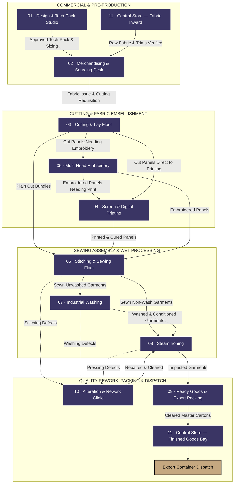

*Diagram legend: Indigo blocks (`#3A3564`) represent the 11 core operating divisions. The tan/gold block represents the terminal business event — container dispatch to the buyer. Solid arrows represent the main clean-pass production flow; dashed arrows represent defect/rework diversions.*

---

# 2. GLOSSARY OF INDUSTRY & TECHNICAL TERMS

This section exists so that every reader — technical or not — can follow the rest of the document without needing to interrupt the meeting to ask what an acronym means.

| Term | Meaning |
|---|---|
| **AQL** | Acceptable Quality Limit. An international statistical sampling standard (ISO 2859-1) that defines how many garments from a lot must be inspected, and how many defects are tolerable, before a shipment is approved or rejected. AQL 2.5 is the standard tier used for general apparel exports. |
| **BOM** | Bill of Materials. The itemized list of every fabric, trim, thread, and packaging component required to produce one garment, along with its cost. |
| **CBM** | Cubic Meters. The unit used to calculate how much container space a shipment will occupy. |
| **CMT** | Cut, Make, Trim. The standard industry term for the labor cost of converting fabric into a finished garment (cutting + sewing + trimming), excluding fabric cost itself. |
| **DST / DSB** | Standard binary file formats (Tajima / Barudan) that store a digitized embroidery design as a sequence of machine stitch instructions. |
| **FOB / CIF** | Free On Board / Cost, Insurance & Freight. Standard international trade (Incoterms) definitions of who bears shipping cost and risk at which point in the journey. |
| **FPY** | First-Pass Yield. The percentage of garments that pass quality inspection on the first attempt, without requiring rework. |
| **GRN** | Goods Received Note. The formal document/record created when incoming material (fabric, trims, cartons) is received and logged at the factory gate. |
| **GSM** | Grams per Square Meter. The standard measure of fabric weight/density. |
| **OEE** | Overall Equipment/Line Efficiency. A measure of how much of a production line's theoretical maximum output is actually being achieved. |
| **POM** | Point of Measure. A specific, named measurement location on a garment (e.g., chest width, sleeve length) used to define and grade sizing. |
| **PPS** | Pre-Production Sample. The final, buyer-approved physical sample that serves as the authoritative reference before bulk production begins. |
| **SAM** | Standard Allowed Minutes. The industry-standard time (in minutes) it should take a competent operator to complete one sewing operation — used to calculate line balancing and piece rates. |
| **SPI** | Stitches Per Inch. A measure of stitch density, which affects seam strength and appearance. |
| **T&A** | Time & Action Calendar. The critical-path schedule mapping every milestone from order booking to shipment, used to track whether an order is on schedule. |
| **Tech-Pack** | The complete technical specification document for a garment style — measurements, fabric, construction detail, and approved artwork — that governs all downstream production. |

---

# 3. MASTER ENTERPRISE DATA ARCHITECTURE & RELATIONAL HANDSHAKE MODEL

## 3.1 The Golden Thread of Garment Traceability

Every piece of data generated on the shopfloor forms an unbroken relational chain in the underlying database. No floor operator can create a sewing allotment without linking it to a physically verified cut bundle. No packing supervisor can seal an export carton without linking it to verified piece counts that trace all the way back to the original cutting lay. This is what makes the Zero Ghost Piece Guarantee enforceable rather than aspirational.

```
-- LEVEL 0: MASTER ENTERPRISE ENTITIES
Brands (Principal Buyers) ──[1:N]──➔ Vendors (Job-Work & Supply Units)
        │                                    │
        ▼ (linked to)                        ▼ (linked to)
-- LEVEL 1: COMMERCIAL CONTRACTS
Buyer Purchase Orders                Vendor Delivery Challans
        │
        ▼
-- LEVEL 2: CUTTING & BUNDLE SEED
Cutting Lay Sheets  ──➔  Cut Garment Bundles  (the origin point of every traceable piece)
        │
        ├──────────────────────────────────────────────────┐
        ▼                                                   ▼
-- LEVEL 3: SEWING FLOOR ALLOTMENT                -- LEVEL 4: EXPORT CARTON BINDING
Lineman Allotments  ──➔  Employees                Carton-to-Bundle Binding  ──➔  Sealed Cartons
        │                (Zero Wage Dispute)                                          │
        ▼                                                                             ▼
Quality Control Logs (Inline / End-of-Line)                        AQL 2.5 Audit Records (Inspector-Signed)
```

**What this means in business terms:** a factory owner or buyer's QA auditor can select any single sealed export carton and trace it backward — through the AQL audit, through the exact bundles packed inside it, through the sewing line and lineman who assembled it, all the way back to the specific fabric roll it was cut from. This level of traceability is not standard in most mid-size garment factories today, and it is the foundation the rest of this document builds on.

## 3.2 Cross-Departmental Information Transmission Protocol

| Sending Division | Receiving Division | What Is Actually Transmitted | What Triggers the Handoff | What Stops a Bad Handoff |
|---|---|---|---|---|
| 01 Design | 02 Merchandising | Approved tech-pack, BOM fabric spec, sizing/grading table | Tech-pack formally signed off | A commercial order cannot be booked without a tech-pack ID that has "PPS Approved" status |
| 02 Merchandising | 03 Cutting | Confirmed order, target quantities, ratio breakdown, delivery date | PO confirmed and fabric verified in-house | Cutting cannot begin a lay without a confirmed order reference |
| 11 Central Store | 03 Cutting | Inspected fabric roll barcodes, verified GSM/width, shade banding | Roll passes 4-Point fabric inspection | Rolls that fail inspection are physically blocked from issue to cutting |
| 03 Cutting | 04 Printing / 05 Embroidery | Barcode-tagged cut panel bundles with exact piece counts | Lay sheet completed and bundles physically banded | Embellishment cannot begin without scanning a valid bundle barcode |
| 03 / 04 / 05 | 06 Stitching | Bundles (plain or decorated) matching the delivery challan | Physical delivery to the line supervisor's bay | A supervisor cannot allocate more pieces to a lineman than the bundle physically contains |
| 06 Stitching | 07 Washing / 08 Ironing | 100% inspected, passed garments with delivery challan | Lot clears final line quality check | Garments still pending alteration are locked out of outward transit |
| 06 / 07 / 08 | 10 Alteration | Defective garment, fault code, and the responsible employee ID | A quality inspector flags a defect | Every defect ticket is permanently linked to who produced it, for accountability |
| 10 Alteration | 08 Ironing | Repaired garment, cleared via a second, independent inspection | Secondary QC sign-off | A repaired garment cannot re-enter the finishing flow without a second inspector's approval — the original repairer cannot self-certify |
| 08 Ironing | 09 Packing | Pressed garments matching approved dimensional tolerances | Finishing inspection log finalized | Garments outside tolerance are diverted back to pressing or alteration, never forwarded |
| 09 Packing | 11 Store / Export | Sealed cartons with barcode packing manifest and AQL 2.5 result | Random audit passes with zero critical defects | A lot that fails AQL is electronically quarantined; the system will not generate an export gate pass for it |

---

# 4. COMPREHENSIVE DIVISION-BY-DIVISION OPERATIONAL BREAKDOWN

---

## DIVISION 00 — CENTRAL ENTERPRISE MODULE HUB
**Route:** `/modules` | **Users:** Executive leadership, plant heads, general managers

### Business Goal
Give leadership a single, bird's-eye view of the entire factory without needing to log into eleven separate systems. The Hub exists to eliminate departmental silos — a plant head should be able to see that a sewing line is behind target, a printing curing oven is running cold, and an export shipment is booked, all from one screen, before their morning walk of the floor.

### What Happens Here Day to Day
Every morning, leadership opens the Hub on a tablet or wall-mounted display. Each division is represented by a live status card showing its current throughput and any active alerts. A single click launches that division's full dashboard.

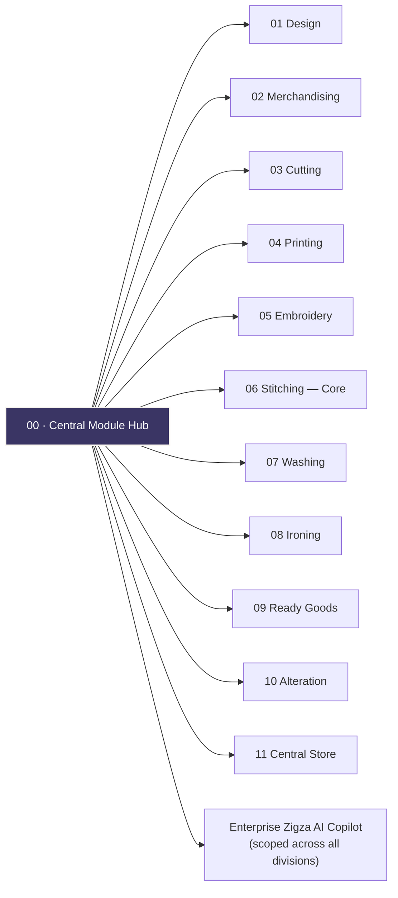

### Menu Items (11 launch cards + 1 enterprise copilot)
One live-status launch card per production division (01 through 11 as listed above), each surfacing that division's single most important live metric (e.g., Cutting shows today's cut volume; Stitching shows First-Pass Yield), plus a dedicated **Enterprise Zigza AI Copilot** with visibility across all eleven divisions' data simultaneously — the only assistant in the platform that can, for example, answer "which division is currently the bottleneck for PO-8901?"

---

## DIVISION 01 — DESIGN & TECH-PACK STUDIO
**Route:** `/design` | **Users:** Fashion designers, CAD pattern masters, technical spec technicians
**Receives from:** Buyer design brief, tech-pack, moodboard, physical swatches
**Delivers to:** Approved tech-pack, graded sizing (POM) tables, seam specification, CAD marker files

### Business Goal
An error caught in design costs a fraction of what the same error costs once it reaches the cutting table — and a small fraction of what it costs once it reaches a buyer's warehouse. This division's job is to create one locked, unambiguous technical source of truth for a garment style before a single meter of fabric is cut.

### What Happens Here Day to Day
A technical designer digitizes the buyer's sketch into a full tech-pack, defines the graded measurement table across every size the style will be produced in, and tracks the physical sample through three approval gates — a proto sample for silhouette, a size-set sample verifying every size, and a Pre-Production Sample (PPS), which is the sealed "golden piece" bulk production is measured against. Only once the PPS is formally approved does the system unlock downstream departments.

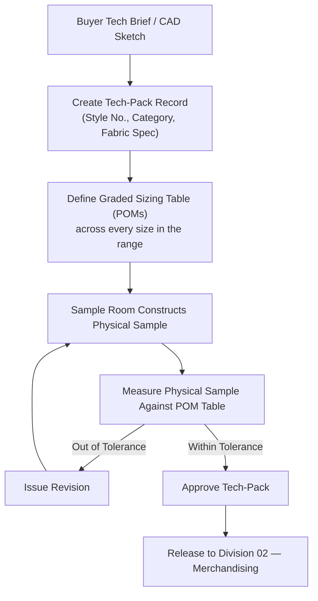

### Menu Items (7 views)
1. **Tech-Pack Catalog** — master repository of every style's specification, with an approval-status badge (Draft, In Sample, Approved).
2. **Sample Approvals** — tracks a garment through Proto → Size Set → Pre-Production Sample, recording exactly why a sample was rejected when it fails.
3. **Size Grading Matrix** — the master table of measurements at every point of the garment, across every size, with the tolerance allowed at each point.
4. **Fabric & Trims Library** — a technical catalog of validated fabrics and trims with their known behavior (shrinkage %, recommended needle size), so designers aren't guessing.
5. **Zigza AI Design Copilot** — flags measurement inconsistencies and estimates fabric consumption directly from pattern dimensions.
6. **Studio Profile** — designer and pattern-master credentials and sign-off authority.

---

## DIVISION 02 — MERCHANDISING & SOURCING DESK
**Route:** `/merchandising` | **Users:** Senior merchandisers, sourcing managers, costing accountants
**Receives from:** Approved tech-pack (01), fabric/trim availability (11)
**Delivers to:** Confirmed production order, costing sheet, critical-path schedule, material requisitions

### Business Goal
This is the commercial heartbeat of the factory — the division that ensures every order booked is actually profitable, that materials arrive just in time rather than early (tying up cash) or late (causing shipment delays), and that the buyer's delivery date is met without resorting to expensive air freight.

### What Happens Here Day to Day
A merchandiser books an incoming buyer order, entering commercial terms and the full color-by-size order matrix. A costing sheet is built line by line — fabric, trims, embellishment, labor, packaging, overhead — to arrive at a target margin. The system then auto-generates a Time & Action calendar with locked milestone dates (lab dip approval, fabric in-house, cutting start, ex-factory date), and issues material requisitions to Central Store.

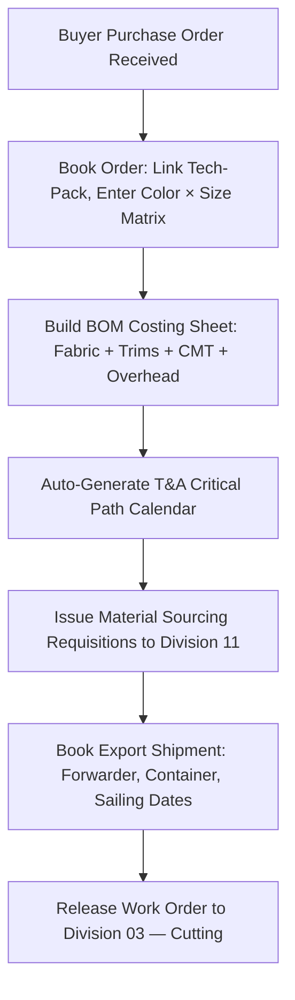

### Menu Items (8 views)
1. **Buyer Purchase Orders** — the full order book, with status and delivery-health indicators per order.
2. **BOM & Costing Ledgers** — line-by-line cost realization, flagging any style where actual material cost is drifting above the quoted budget.
3. **Time & Action Calendar** — the critical-path schedule for every order, with delayed milestones surfaced immediately.
4. **Trim & Sourcing Requisitions** — the procurement request queue pushed directly to Central Store.
5. **Shipment & FOB Pipeline** — container bookings, freight forwarder details, and Bill of Lading tracking.
6. **Zigza AI Merchandising Copilot** — predicts which orders are at risk of missing their ex-factory date based on current production velocity.
7. **Desk Profile** — merchandiser portfolio assignments and commercial signing limits.

*Note: brand and vendor commercial records are managed centrally in Division 06's Brand & Vendor directory, not duplicated here, so that every division references the same single source of truth for who a buyer or contractor is.*

---

## DIVISION 03 — CUTTING & LAY FLOOR
**Route:** `/cutting` | **Users:** Cutting floor incharge, spreading operators, bundle clerks
**Receives from:** Confirmed order (02), inspected fabric rolls (11)
**Delivers to:** Barcode-tagged cut garment bundles, panel QC results, fabric consumption/waste log

### Business Goal
Fabric is 60–70% of total garment cost. This division's job is to maximize how much usable garment is extracted from every meter of fabric, and — critically for the rest of the system — to be the point where the Zero Ghost Piece Guarantee actually begins: every bundle created here becomes a permanently traceable unit for the rest of the garment's life in the factory.

### What Happens Here Day to Day
Operators spread inspected fabric across cutting tables in multiple layers (plies) and log the lay. The fabric is cut — by computerized cutter or by hand — and every resulting stack of panels is inspected for accuracy against the master pattern. Each verified stack is then divided into individually barcoded bundles, and any leftover fabric is weighed and logged so that not a single meter goes unaccounted for.

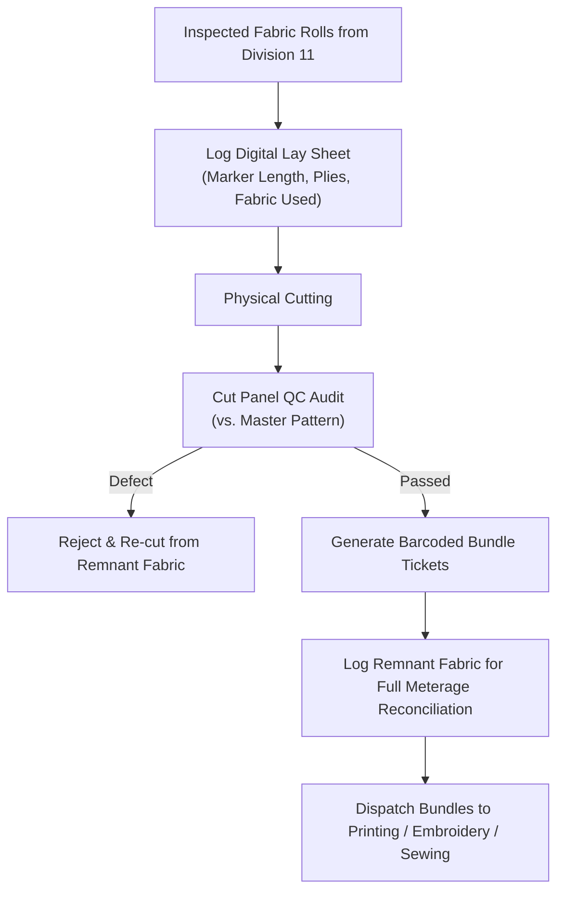

### Menu Items (8 views)
1. **Spreading & Lay Sheets** — the digital record of every fabric lay: rolls used, plies stacked, marker length.
2. **Marker Efficiency Planner** — calculates how efficiently a given pattern layout uses the fabric width, since even a 1–2% efficiency gain across a large order is a meaningful cost saving.
3. **Bundle QR Ticket Station** — generates the unique barcode ticket for every bundle, the single most important document in the entire traceability chain.
4. **Fabric Rolls & End-Bit Log** — roll-by-roll reconciliation of meters issued versus meters actually used, so leftover fabric is never simply "lost."
5. **Cut Panel QC Audit Station** — inspection records checking that top, middle, and bottom layers of a cut stack all match the pattern precisely.
6. **Zigza AI Cutting Copilot** — suggests how to fit an additional small marker into leftover fabric rather than scrapping it.
7. **Cutting Floor Profile** — cutting master credentials and table/machine assignments.

---

## DIVISION 04 — SCREEN & DIGITAL PRINTING UNIT
**Route:** `/printing` | **Users:** Printing floor master, color kitchen chemist, screen technicians
**Receives from:** Cut panels (03), embroidered panels (05, when embroidery precedes printing)
**Delivers to:** Cured, wash-fast printed panels

### Business Goal
Printing adds visible value to a garment, but it is also the single most unforgiving process in the factory — a misaligned screen or an under-cured panel is permanently ruined, and that panel's fabric cost is a total loss. This division's job is to guarantee color accuracy and full wash-fastness before a single bulk panel is printed, and to catch any defect before it reaches sewing.

### What Happens Here Day to Day
The color kitchen mixes the ink formulation to match the buyer's approved color reference. A sample strike-off is printed and formally approved before bulk production starts. Cut bundles arrive, are scanned, and run through the print tables and a heat-curing tunnel. At shift end, the inspector logs exactly how many panels passed and how many were rejected, and why.

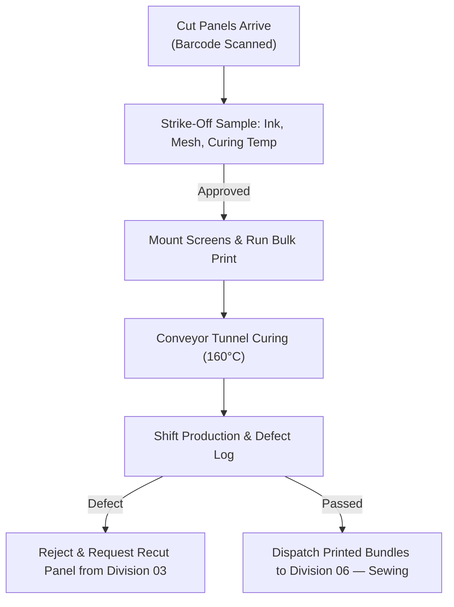

### Menu Items (8 views)
1. **Screen & Stencil Library** — inventory of prepared print screens by mesh count and condition.
2. **Table Batch Queue & DTG Runs** — the live schedule of what is currently printing on which table.
3. **Strike-Off Lab Approvals** — the formal color-match approval history for every style, comparing measured color against the buyer's reference.
4. **Ink Kitchen & Recipes** — the exact chemical formulation ledger per batch, ensuring repeatable, consistent color.
5. **Curing Oven & Fastness QC** — continuous temperature logging, since under-curing is invisible until a garment fails a wash test weeks later.
6. **Zigza AI Printing Copilot** — recommends ink and curing adjustments for humidity or fabric changes.
7. **Printing Unit Profile** — technician certifications and table assignments.

---

## DIVISION 05 — MULTI-HEAD EMBROIDERY FLOOR
**Route:** `/embroidery` | **Users:** Embroidery supervisor, digitizing master, machine operators
**Receives from:** Cut panels (03), or pre-printed panels (04, when printing precedes embroidery)
**Delivers to:** Inspected embroidered panels, and a stitch-count ledger used for billing

### Business Goal
Embroidery machines run at up to 1,000 stitches per minute across 20 needles simultaneously — a small setup error scales into a large batch of defective panels almost instantly. This division's job is precision execution at speed, and accurate stitch-count billing, since embroidery cost (whether to a buyer or an internal cost center) is calculated directly from stitches run, not pieces.

### What Happens Here Day to Day
A digitizer converts the buyer's artwork into a machine stitch file, defining stitch count, color sequence, and the correct backing stabilizer for the fabric. Cut panels are hooped, the machine run is executed and logged — including any thread breaks, which cause downtime — and finished panels are trimmed of loose threads and inspected before being re-banded for dispatch.

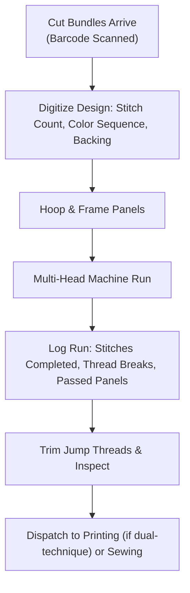

### Menu Items (8 views)
1. **DST Punch File Library** — the master archive of digitized embroidery designs with stitch counts and color-stop previews.
2. **Machine Runs & Hooping** — live status of every embroidery machine: which design is running, heads active, elapsed time.
3. **Stitch Count & Billing Ledger** — converts total stitches run into commercial billing or internal cost allocation, since this is the actual basis for embroidery pricing.
4. **Thread Store & Cones Log** — inventory of embroidery thread by shade and brand.
5. **Quality & Thread Break QC** — root-cause tracking for bird-nesting, tension issues, and needle damage.
6. **Zigza AI Embroidery Copilot** — estimates whether a shift can complete a given order before a deadline based on current machine speed.
7. **Embroidery Floor Profile** — digitizer and technician credentials.

---

## DIVISION 06 — STITCHING & SEWING FLOOR *(The Operational Core / Benchmark Division)*
**Route:** `/stitching-sewing` | **Users:** Floor supervisors, line incharges, linemen, QC auditors, store incharge
**Receives from:** Cut, printed, or embroidered bundles (03/04/05), thread and trims (11)
**Delivers to:** 100% QC-passed garments to Washing (07) or Ironing (08); defects to Alteration (10)

### Business Goal
This is the assembly heart of the factory, and the division every other division's documentation is structurally modeled on. Its three goals are: keep sewing lines running at high efficiency (target ≥85% line efficiency), guarantee every operator is paid exactly and only for verified passed work (eliminating wage disputes entirely), and maintain a First-Pass Yield of 97.5% or higher.

### What Happens Here Day to Day
A supervisor receives cut bundles and creates a daily allotment ticket for each lineman — critically, this ticket is bound both to the exact physical bundle and to the specific employee, and the system will not allow the sum of allotments against one bundle to exceed that bundle's actual cut piece count. Operators sew progressively along the line. Inline and end-of-line inspectors check 100% of output; passed garments immediately credit the lineman's piece-rate wage, while defective garments automatically generate an alteration ticket, holding that lineman's wage credit in escrow until the piece is repaired and cleared.

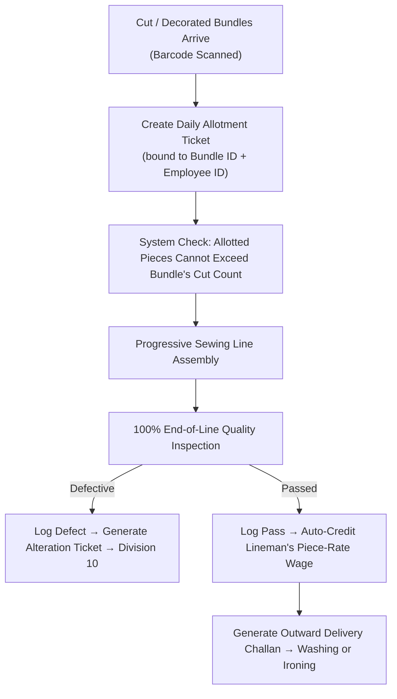

### Menu Items (13 views — the most complete division in the platform, reflecting its role as the core)
1. **Central Enterprise Hub link** — direct return path to the全enterprise dashboard.
2. **Master Floor Dashboard** — real-time line velocity, active operator count, First-Pass Yield, with a dedicated full-screen TV mode for shopfloor overhead monitors.
3. **Store & Godown Receiving** — a five-part inward station covering truck receiving, accessory issue to linemen, live handshakes with Central Store, finished-goods racking, and damaged-material reissue.
4. **Zigza AI Sewing Copilot** — answers questions about hourly line throughput, individual lineman wage calculations, and how long challans have been sitting open.
5. **Production Chart & Orders Hub** — challan management with brand/vendor filtering and bulk Excel import for high-volume order entry.
6. **Target Allotments & Bundle Binding** — the core wage-and-traceability screen: every piece-rate ticket bound to both a bundle and an employee.
7. **Godown & WIP Inventory** — live view of exactly how many pieces are on the line right now versus staged and ready.
8. **Dispatch & Challan Gate Passes** — generates the outward delivery documentation for every completed lot.
9. **Supervisor Profile** — shift credentials and line assignment history.
10. **Brands & Multi-Vendor Directory** — the single, authoritative registry separating principal buyers (brands) from contract job-work vendors, used by every other division that needs to reference a brand or vendor.
11. **Floor Employees & Linemen Registry** — the master employee directory with skill grades and role classifications, the foundation the wage-dispute guarantee is built on.
12. **Articles & Piece-Rate Catalog** — the garment style repository defining stitching rates and standard time allowances.
13. **Reports & Analytics** — daily wage payout ledgers, rejection Pareto charts, and exportable production records.

---

## DIVISION 07 — INDUSTRIAL WASHING & WET PROCESSING
**Route:** `/washing` | **Users:** Washing floor master, laundry chemical technician
**Receives from:** Stitched garments (06)
**Delivers to:** Washed, dimensionally stable garments to Ironing (08); shrinkage alerts to Cutting (03)

### Business Goal
A raw stitched garment cannot go straight to a buyer's shelf — denim, twill, and many knits need washing for hand-feel and, more importantly, for dimensional stability. This division's job is to deliver the buyer's specified finish while guaranteeing the garment still matches its approved measurements after the wash — because a garment that shrinks out of spec after washing is a defect the buyer will discover, not one the factory catches.

### What Happens Here Day to Day
Stitched lots are loaded into industrial washers with a precisely dosed chemical recipe — enzyme, silicone softener, or other treatment as specified. After washing and drying, a statistically meaningful sample of garments is measured against the pre-wash dimensions. If shrinkage exceeds the allowed tolerance, an automated alert is sent upstream to Cutting and Design so future lays can be adjusted before more fabric is wasted.

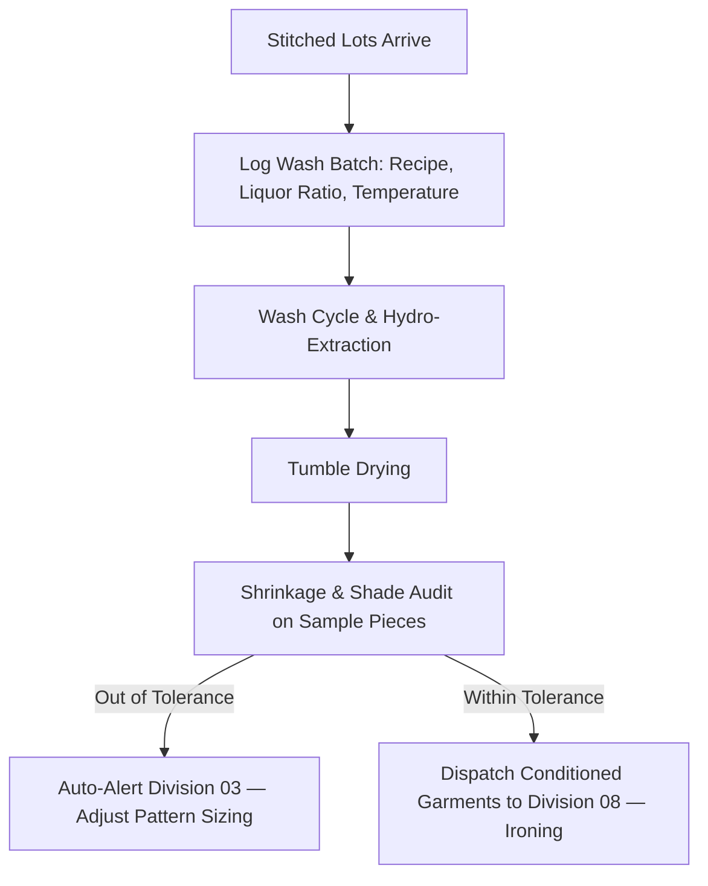

### Menu Items (8 views)
1. **Wash Recipes & Chemistry** — the formulation library for every wash type the factory offers.
2. **Tumbler & Hydro Runs** — the live scheduling console for washing machines and extractors.
3. **Liquor Ratio & Water Audit** — cost and environmental tracking of water usage per kilogram of garment washed.
4. **Shrinkage & Fastness QC** — the dimensional measurement station that protects the buyer relationship most directly.
5. **Outward Finishing Handover** — the sign-off transferring conditioned garments to Ironing.
6. **Zigza AI Washing Copilot** — recommends chemical dosage adjustments and flags shrinkage trends before they become a pattern.
7. **Washing Division Profile** — chemical handling certifications and compliance records.

---

## DIVISION 08 — IRONING & STEAM PRESSING FLOOR
**Route:** `/iron` | **Users:** Finishing incharge, vacuum ironing operators
**Receives from:** Washed garments (07) or unwashed garments direct from Sewing (06)
**Delivers to:** Wrinkle-free, dimensionally verified garments to Ready Goods (09)

### Business Goal
This is the retail-presentation stage — the last chance to catch a dimensional or cosmetic problem before a garment is sealed into a carton. The goal is a completely wrinkle-free, correctly shaped, glaze-free garment, with the operator's wage tied directly and only to verified pressed output.

### What Happens Here Day to Day
Operators are assigned to vacuum steam pressing tables and log their production. Garments are steamed and shaped, then immediately inspected — for shine or glaze (a sign of excess heat), scorching, or water spotting. Passed garments move straight to packing; anything defective is diverted to the Alteration Clinic rather than allowed through.

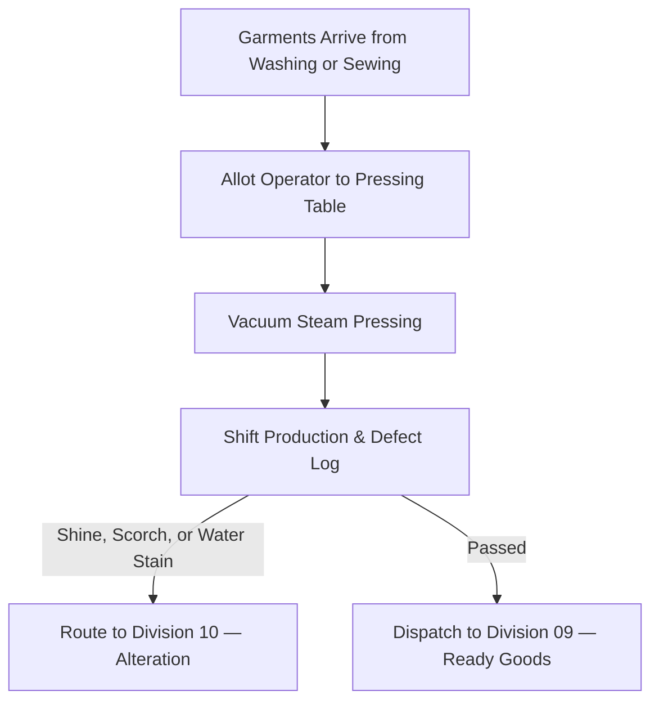

### Menu Items (8 views)
1. **Steam Vacuum Buck Tables** — station-by-station operator assignment and active lot tracking.
2. **Operator Piece-Rate Wages** — the wage ledger for pressing staff, calculated exactly the same principled way as Division 06's lineman wages: verified passed pieces only.
3. **Boiler Telemetry & Steam Log** — continuous pressure monitoring of the central steam supply, since inconsistent pressure directly causes fabric shine defects.
4. **Inline Finish & Glaze QC** — the visual inspection record for every batch.
5. **Outward Packing Handover** — the sign-off transferring pressed garments to the packing floor.
6. **Zigza AI Ironing Copilot** — recommends maximum safe iron temperature per fabric type to prevent shine.
7. **Ironing Floor Profile** — presser credentials and equipment maintenance logs.

---

## DIVISION 09 — READY GOODS & EXPORT CARTON PACKING
**Route:** `/ready-goods` | **Users:** Packing master, barcode scanning operators, QA auditors
**Receives from:** Pressed garments (08), cartons/polybags (11)
**Delivers to:** Sealed, AQL-certified export cartons to Central Store (11) for container loading

### Business Goal
This is the final legal gate of the factory. Once a carton is sealed and palletized, any defect inside becomes a direct commercial liability — a chargeback, a rejected shipment, or reputational damage with the buyer. This division's job is to guarantee that what a carton's label claims is inside is exactly and only what is physically inside.

### What Happens Here Day to Day
Garments are tagged, folded, and polybagged, then packed into cartons — and the system enforces, at the database level, that the total pieces packed from any one bundle across all cartons can never exceed that bundle's original cut count. Once cartons are packed, an independent QA auditor conducts a statistical AQL 2.5 audit on a sample of sealed cartons. If the lot passes, the system authorizes release; if it fails, the system automatically locks the lot and blocks gate-pass generation until the failure is resolved — no manual override is available at the packing-floor level.

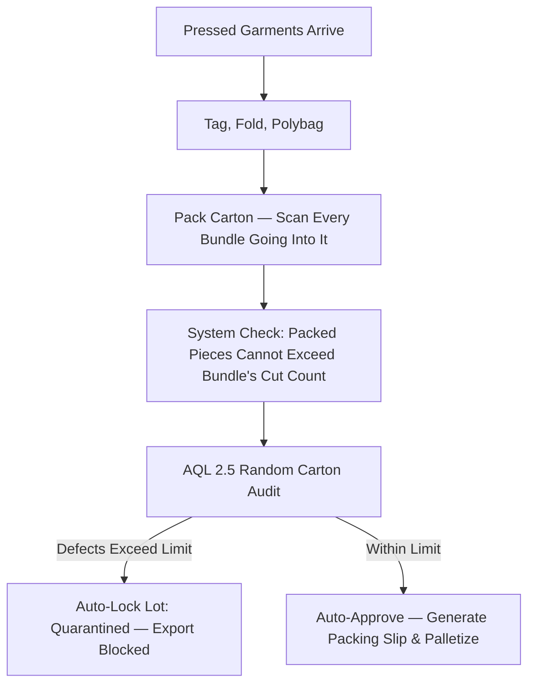

### Menu Items (8 views)
1. **AQL 2.5 Inspection Station** — the formal statistical audit console, following the ISO 2859-1 sampling standard.
2. **Hangtag & Polybag Station** — barcode verification of individual garment hangtags before bagging.
3. **Carton Packing Manifest** — the live record of what is going into each open carton, auto-summed by size.
4. **Scale Weight & Audit Log** — digital scale integration confirming a carton's actual weight matches its expected weight — an immediate flag for missing pieces.
5. **Central Godown Handover** — the sign-off releasing sealed cartons to Central Store for final staging.
6. **Zigza AI Packing Copilot** — calculates container cube utilization and flags any carton whose measured weight doesn't match its expected weight.
7. **Ready Goods Profile** — packing supervisor and certified AQL inspector credentials.

---

## DIVISION 10 — ALTERATION & QUALITY REWORK CLINIC
**Route:** `/alter` | **Users:** Quality mending incharge, alteration tailors
**Receives from:** Defective garments flagged in Sewing (06), Washing (07), or Ironing (08)
**Delivers to:** Repaired, independently re-cleared garments back to Ironing (08); irreparable scrap logged and closed

### Business Goal
Every factory produces some defective output — the difference between a profitable factory and an unprofitable one is how efficiently those defects are recovered rather than discarded. This division's job is to salvage everything that can reasonably be salvaged, track defect patterns back to their root cause (a specific operator, machine, or process step), and ensure that every single defective piece is formally accounted for, with nothing quietly written off or hidden.

### What Happens Here Day to Day
A defect is flagged upstream, and a ticket is created linking the garment to its defect type and the employee responsible. The garment physically arrives at the clinic, is triaged as repairable or not, and — if repairable — is mended by a specialist tailor. Critically, the repair is then checked by a **second, independent inspector** — the person who repaired the garment cannot be the person who clears it. Only after this second sign-off does the garment re-enter the finishing flow.

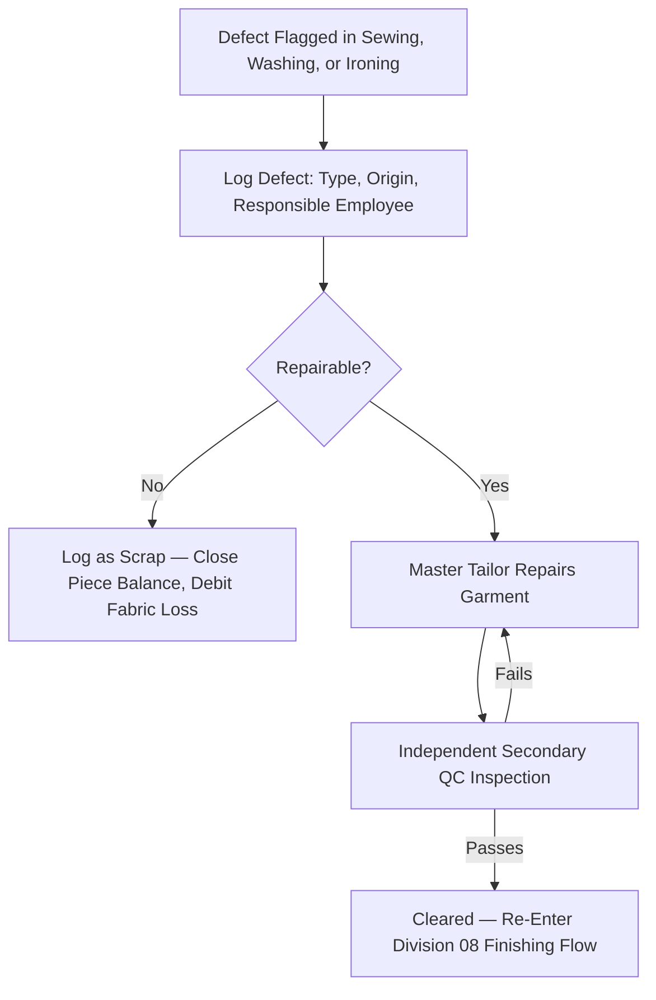

### Menu Items (8 views)
1. **Defect Intake & Pareto** — the triage gate where every incoming defect is logged and classified.
2. **Master Mending Stations** — workstation assignments for senior tailors handling seam and construction repairs.
3. **Chemical Spotting & Cleaning Desk** — the specialized station for removing oil stains and marks without damaging fabric.
4. **Secondary AQL Re-Inspection** — the mandatory independent check before any repaired garment is allowed to re-enter production flow.
5. **Scrap Salvage & Write-Off Ledger** — the formal, auditable record of anything declared unrecoverable, protecting against undocumented losses.
6. **Zigza AI Quality Clinic Copilot** — analyzes recurring defect clusters to flag a specific machine or process step before the pattern gets worse.
7. **Alteration Clinic Profile** — senior tailor and QA inspector credentials.

---

## DIVISION 11 — CENTRAL STORE & RAW MATERIAL GODOWN
**Route:** `/store` | **Users:** Chief storekeeper, godown incharge, fabric inspectors
**Receives from:** Fabric mills, trim suppliers, sealed cartons from Ready Goods (09)
**Delivers to:** Certified fabric to Cutting (03), trims to Sewing (06), containers to export dispatch

### Business Goal
The Central Store is the physical custodian of every material asset the factory owns — both raw material coming in and finished goods waiting to leave. Its job is to stop substandard fabric from ever reaching the cutting table, prevent inventory leakage of any kind, and coordinate the final, accurate loading of export containers.

### What Happens Here Day to Day
Trucks arrive and are logged in at the gate. Fabric rolls are moved to an inspection bay where certified inspectors run the industry-standard 4-point fabric inspection; any roll scoring above the acceptable defect threshold is rejected and quarantined before it can ever reach a cutting table. Passed rolls are barcoded and racked. When Cutting or Sewing needs material, it is issued with a digital sign-off. On the finished-goods side, sealed cartons from Packing are staged and eventually loaded into export containers against the shipping manifest.

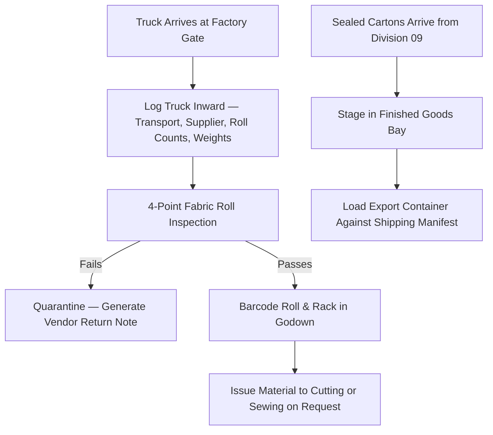

### Menu Items (8 views)
1. **Fabric Godown & 4-Point QC** — the inspection console enforcing the ASTM 4-point fabric quality standard.
2. **Trims & Accessories Warehouse** — bin-level inventory of threads, zippers, labels, and packaging materials.
3. **Truck Inward Gate** — the security and receiving console generating every incoming Goods Received Note.
4. **Material Issues to Floor** — the barcode-scanned dispatch station releasing verified material to production.
5. **Finished Goods Bay** — the staging warehouse for palletized export cartons awaiting container arrival.
6. **Zigza AI Central Store Copilot** — predicts reorder points based on current production consumption velocity.
7. **Central Store Profile** — storekeeper authorizations and stocktaking records.

---

# 5. THE ALTERATION, REJECTION & QUARANTINE CLOSED-LOOP CIRCUIT

## 5.1 Defect Classification & Escalation Matrix

| Tier | Examples | Where Detected | What Happens | Escalation |
|---|---|---|---|---|
| **Tier 1 — Minor / Reworkable** | Skipped stitch, loose thread tension, wavy hem, removable spot | Sewing, Ironing | Routed to Alteration Clinic. The original lineman's wage credit remains pending until repair is certified. | Repaired and re-inspected by a second QC inspector. |
| **Tier 2 — Critical / Component Failure** | Cut panel tear, needle burn, permanent print smudge, out-of-tolerance shrinkage | Cutting, Printing, Washing | Panel is condemned; a recut authorization is automatically issued to Cutting; the cost is debited to the responsible unit's ledger. | If a defect rate exceeds 3% of an order, the line is automatically paused and the department head is alerted. |
| **Tier 3 — Fatal / Batch Quarantine** | AQL audit failure, broken needle detected by metal detector | Ready Goods (AQL Gate) | The entire lot is locked electronically. No gate pass can be generated for it. | A hard system block — not a policy, a database rule — prevents any shipment of a quarantined lot without Plant Head sign-off. |

## 5.2 Re-Work Handshake & Secondary Clearance Flowchart

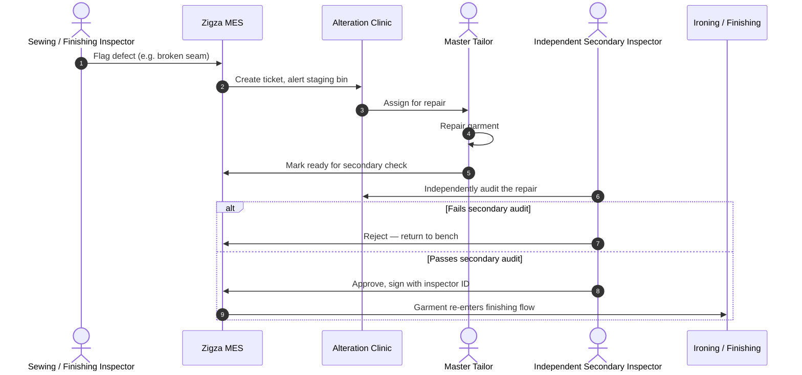

**The business reason this matters:** the person who repairs a garment is never the person who approves it. This single rule — a second, independent set of eyes — is what prevents a repair being quietly rubber-stamped under production pressure, and it is enforced structurally, not just by policy.

---

# 6. FINANCIAL RECONCILIATION, COMMERCIAL BILLING & WAGE LEDGER ENGINE

## 6.1 Lineman Piece-Rate Wage Calculation — The Zero-Dispute Formula

$$\text{Operator Daily Wage (₹)} = \sum \left( \text{Verified Passed Pieces} \times \text{Approved Piece Rate per Article} \right)$$

Three rules make this formula dispute-proof rather than just a calculation:

1. Allotments to any lineman are hard-capped at the bundle's actual cut piece count — a supervisor physically cannot over-allocate.
2. Wages are credited only when an inspector logs a piece as passed — not when an operator claims it.
3. A piece pending alteration holds its wage credit in escrow until the repair is independently cleared; irreparable scrap earns zero wage credit.

## 6.2 Vendor Sub-Contract Settlement — Worked Example

**Scenario:** A contract stitching unit, "Shanti Garments," is issued 3,000 cut pieces on Challan JOB-457 for brand OLLYPOP.

| Step | Figure |
|---|---|
| Pieces issued by Store | 3,000 |
| Pieces physically received back | 2,950 *(50-piece shortage)* |
| QC Passed | 2,900 |
| QC Failed / irreparable | 50 |
| Contract stitching rate | ₹20.00 / piece |
| Fabric value per piece | ₹120.00 / piece |

$$\text{Gross Stitching Earned} = 2{,}900 \times ₹20.00 = ₹58{,}000$$
$$\text{Shortage \& Scrap Penalty} = (50 + 50) \times ₹120.00 = ₹12{,}000$$
$$\mathbf{\text{Net Vendor Payout}} = ₹58{,}000 - ₹12{,}000 = \mathbf{₹46{,}000}$$

The system generates this settlement automatically — no manual reconciliation of vendor invoices is required, and the shortage penalty is never a point of negotiation after the fact, because both sides can see the same verified data.

## 6.3 BOM Costing Realization & Fabric Consumption Variance

$$\text{Fabric Variance \%} = \frac{\text{Actual Fabric Consumed} - \text{Budgeted Fabric}}{\text{Budgeted Fabric}} \times 100$$

A positive variance means more fabric was consumed than quoted to the buyer — a signal to review cutting efficiency. A negative variance is a real, monetized saving credited directly to margin.

---

# 7. QUANTIFIED BUSINESS IMPACT & RETURN ON INVESTMENT

The figures below are the kind of order-of-magnitude impact a factory of meaningful scale should expect to see once the system is fully live across all 11 divisions. They are illustrative planning figures, not a guarantee, and should be recalibrated against the specific factory's actual order volume, headcount, and current defect/dispute rates once real data is available.

| Risk Area (from Section 1.1) | Mechanism That Addresses It | Expected Business Effect |
|---|---|---|
| Ghost pieces & inventory shrinkage | Bundle-level traceability, database-enforced piece ceilings | Eliminates unexplained shortfall between cut and packed quantities; every piece is either shipped or accounted for as a documented defect |
| Piece-rate wage disputes | Wage credit tied strictly to inspector-verified passed pieces, bound to a specific bundle | Removes the structural cause of claimed-vs-cut wage drift entirely, rather than trying to detect it after payroll |
| Sub-contractor financial leakage | Automated shortage/scrap penalty calculation at settlement | Vendor payouts are self-auditing; shortage disputes are resolved by the data itself, not negotiation |
| Export chargebacks & under/over-stuffing | Mandatory carton-to-bundle binding, hard piece-count ceiling on every carton | A sealed carton's contents are mathematically guaranteed to match its manifest before it ever leaves the building |
| Buyer AQL failures reaching the market | Automatic lot quarantine on AQL failure, no manual override at floor level | Failed lots are physically prevented from receiving an export gate pass — a quality failure cannot slip through under time pressure |

**Framing for leadership:** the value of this system is not primarily "faster paperwork." It is the conversion of four categories of *unmeasured, unrecoverable* loss into *measured, structurally prevented* loss — the difference between finding out about a problem from a buyer's chargeback email, and never having the problem occur in the first place.

---

# 8. PHASED IMPLEMENTATION ROADMAP

| Phase | Scope | Status |
|---|---|---|
| **Phase 1 — Core Benchmark** | Division 06 (Stitching & Sewing) fully live in production, including the employee master, wage engine, and bundle-binding quantity triggers. This division served as the architectural benchmark all other divisions were built to match. | **Complete — live in production** |
| **Phase 2 — Upstream & Downstream Adjacent** | Division 03 (Cutting), Division 09 (Ready Goods & Packing), Division 11 (Central Store) — the three divisions that directly close the Zero Ghost Piece chain end to end. | Specification complete, ready for build |
| **Phase 3 — Embellishment & Wet Processing** | Division 04 (Printing), Division 05 (Embroidery), Division 07 (Washing), Division 08 (Ironing) | Specification complete, ready for build |
| **Phase 4 — Commercial & Recovery Layer** | Division 01 (Design), Division 02 (Merchandising), Division 10 (Alteration) | Specification complete, ready for build |
| **Phase 5 — Enterprise Rollout** | Division 00 (Central Hub) and enterprise-wide AI Copilot, unifying visibility across all 11 divisions | Pending Phase 2–4 completion |

*Recommendation: phasing should prioritize whichever division currently represents the factory's largest unmeasured cost — for most mid-size units, this is typically Cutting (fabric cost) or Ready Goods (chargeback exposure), suggesting Phase 2 as the immediate next build priority.*

---

# 9. EXECUTIVE GOVERNANCE & SENIOR MANAGEMENT SIGN-OFF

## 9.1 Enterprise Portal Directory Summary

| Division | Name | Route | Menu Items | Core Business Risk Mitigated |
|---|---|---|---|---|
| 00 | Central Module Hub | `/modules` | 11 launch cards + AI copilot | Departmental blindspots |
| 01 | Design & Tech-Pack Studio | `/design` | 7 | Pre-production sizing errors reaching bulk cutting |
| 02 | Merchandising & Sourcing | `/merchandising` | 8 | Commercial margin erosion, shipment delay |
| 03 | Cutting & Lay Floor | `/cutting` | 8 | Fabric waste, ghost-piece origination |
| 04 | Screen & Digital Printing | `/printing` | 8 | Ink defects, panel scrap |
| 05 | Multi-Head Embroidery | `/embroidery` | 8 | Thread-break downtime, needle damage |
| 06 | Stitching & Sewing (Core) | `/stitching-sewing` | 13 | Wage dispfor utes, uninspected garment flow |
| 07 | Industrial Washing | `/washing` | 8 | Buyer rejections from post-wash shrinkage |
| 08 | Steam Ironing | `/iron` | 8 | Scorched garments, dimensional miscalibration |
| 09 | Ready Goods & Packing | `/ready-goods` | 8 | Missing carton pieces, AQL chargebacks |
| 10 | Alteration & Rework Clinic | `/alter` | 8 | Undocumented scrap, unrecovered rework cost |
| 11 | Central Store & Godown | `/store` | 8 | Substandard fabric reaching cutting, inventory leakage |

## 9.2 Formal Review & Approval

This manual has been reviewed and is submitted for formal sign-off by the following stakeholders prior to full enterprise rollout:

| Role | Name | Signature | Date |
|---|---|---|---|
| Managing Director | | | |
| Chief Financial Officer | | | |
| Head of Factory Operations | | | |
| Quality Assurance Director | | | |
| IT Engineering Lead | | | |

---

# 10. APPENDIX — CONSOLIDATED NAVIGATION & DATA REFERENCE TABLE

| Division | Full Menu Item List |
|---|---|
| 01 Design | Tech-Pack Catalog · Sample Approvals · Size Grading Matrix · Fabric & Trims Library · Zigza AI Copilot · Studio Profile |
| 02 Merchandising | Buyer Purchase Orders · BOM & Costing Ledgers · Time & Action Calendar · Trim & Sourcing Requisitions · Shipment & FOB Pipeline · Zigza AI Copilot · Desk Profile |
| 03 Cutting | Spreading & Lay Sheets · Marker Efficiency Planner · Bundle QR Ticket Station · Fabric Rolls & End-Bit Log · Cut Panel QC Audit · Zigza AI Copilot · Cutting Floor Profile |
| 04 Printing | Screen & Stencil Library · Table Batch Queue & DTG Runs · Strike-Off Lab Approvals · Ink Kitchen & Recipes · Curing Oven & Fastness QC · Zigza AI Copilot · Printing Unit Profile |
| 05 Embroidery | DST Punch File Library · Machine Runs & Hooping · Stitch Count & Billing Ledger · Thread Store & Cones Log · Quality & Thread Break QC · Zigza AI Copilot · Embroidery Floor Profile |
| 06 Stitching | Master Floor Dashboard · Store & Godown Receiving · Zigza AI Copilot · Production Chart & Orders · Target Allotments & Bundles · Godown & WIP Inventory · Dispatch & Challan Hub · Supervisor Profile · Brands & Vendor Directory · Employees & Linemen · Articles & Piece-Rate Catalog · Reports & Analytics |
| 07 Washing | Wash Recipes & Chemistry · Tumbler & Hydro Runs · Liquor Ratio & Water Audit · Shrinkage & Fastness QC · Outward Finishing Handover · Zigza AI Copilot · Washing Division Profile |
| 08 Ironing | Steam Vacuum Buck Tables · Operator Piece-Rate Wages · Boiler Telemetry & Steam Log · Inline Finish & Glaze QC · Outward Packing Handover · Zigza AI Copilot · Ironing Floor Profile |
| 09 Ready Goods | AQL 2.5 Inspection Station · Hangtag & Polybag Station · Carton Packing Manifest · Scale Weight & Audit Log · Central Godown Handover · Zigza AI Copilot · Ready Goods Profile |
| 10 Alteration | Defect Intake & Pareto · Master Mending Stations · Chemical Spotting & Cleaning · Secondary AQL Re-Inspection · Scrap Salvage & Write-Off · Zigza AI Copilot · Alteration Clinic Profile |
| 11 Central Store | Fabric Godown & 4-Point QC · Trims & Accessories Warehouse · Truck Inward Gate · Material Issues to Floor · Finished Goods Bay · Zigza AI Copilot · Central Store Profile |

*End of Document.*