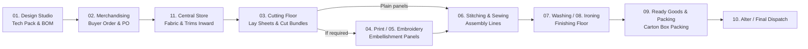
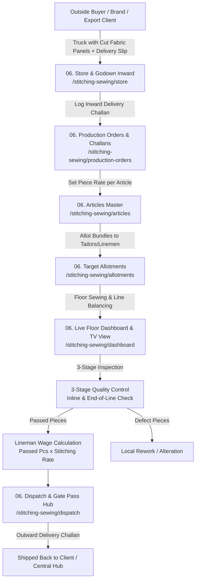

# 🧵 Stitching & Sewing Floor (Module 06) — Complete Article Flow Guide
### *How Articles Move Through the Sewing Floor in Both Integrated & Standalone Factories*

---

## 1. Simple Summary: What is Module 6?

**Module 6 (Stitching & Sewing Floor)** is the central assembly hub of a garment factory. This is where individual cut pieces of cloth (front body, back body, sleeves, collars, pockets) and accessories (thread, buttons, zippers, labels) are stitched together into complete, wearable garments.

In the garment industry, factories operate in **two main ways**:

```
                               ┌────────────────────────────────────────────────────────┐
                               │            ZIGZA MES: MODULE 6 SEWING FLOOR             │
                               └──────────────────────────┬─────────────────────────────┘
                                                          │
                    ┌─────────────────────────────────────┴─────────────────────────────────────┐
                    ▼                                                                           ▼
     [ FACTORY TYPE 1: INTEGRATED FACTORY ]                                      [ FACTORY TYPE 2: STANDALONE CMT FACTORY ]
     • Owns Design & Tech Packs (Module 1)                                       • DOES NOT use Modules 1 to 5
     • Buys Raw Fabric & Yarns (Module 2 & 11)                                   • Receives ready-cut panels from outside buyers
     • Cuts Fabric In-House (Module 3)                                           • Direct Challan / Job-Work Inward
     • In-House Printing / Embroidery (Mod 4 & 5)                                • Focuses 100% on Stitching, Lines & Tailors
     • Feeds cut bundles directly into Module 6                                  • Dispatches finished garments back to client
```

Zigza MES is specifically designed with a **modular architecture** so it works smoothly in **both scenarios**:
1. **Full Vertical Mills** that use all 11 modules from scratch to finish.
2. **Independent CMT / Job-Work Units (Cut-Make-Trim)** that **only use Module 6** without needing Modules 1, 2, 3, 4, or 5.

---

## 2. Factory Type 1: The Integrated Factory Flow (Modules 1 to 5 Connected)

In a large, complete factory (doing design, cutting, and stitching all under one roof), an article passes through a complete chain before reaching the sewing machines:



### How the Article Moves in Type 1:
1. **Design & Merchandising (Modules 1 & 2)**: The style (e.g. `DEMO-101` Polo T-Shirt) is created with its fabric requirements, piece measurements, and buyer purchase orders.
2. **Store & Cutting (Modules 11 & 3)**: Fabric rolls are inspected and cut into numbered bundles (e.g. 50 pieces per bundle with barcode tags).
3. **Printing / Embroidery (Modules 4 & 5)**: If the shirt has a chest logo or graphic print, the cut panels are sent for printing/embroidery first.
4. **Sewing Floor Inward (Module 6)**: The cut bundles arrive at the sewing line. The supervisor scans the bundle barcodes (`cutting_bundles`) and starts the stitching lines.

---

## 3. Factory Type 2: The Standalone / Job-Work Factory Flow (Modules 1 to 5 Bypassed)

Many factories **do not cut fabric and do not design tech packs**. They are pure **Stitching Units (Job-Workers / CMT Vendors)**. 

An outside brand (like *Zara*, *Raymond*, or an export house) sends them ready-cut fabric bundles in trucks along with a delivery challan.

**In this case, Modules 1, 2, 3, 4, and 5 are completely skipped.**



### How the Article Moves in Type 2 (Pure Standalone):
1. **Truck Gate Inward**: The delivery vehicle arrives. The supervisor logs the client's challan number and roll/bundle count at `/stitching-sewing/store`.
2. **Direct Challan / Order Entry**: The supervisor creates a Production Order directly at `/stitching-sewing/production-orders` (or uploads an Excel sheet from the buyer).
3. **Set Piece Rate**: In `/stitching-sewing/articles`, the rate paid to tailors (e.g. `₹18 per piece`) is set for that article style.
4. **Allot to Linemen**: In `/stitching-sewing/allotments`, bundles or daily piece targets are assigned to tailors/linemen.
5. **Stitching & QC**: Operators sew the garments; QC marks them as **Passed** or **Defect**.
6. **Wages & Dispatch**: The system automatically calculates daily operator wages and generates an outward Delivery Challan (`/stitching-sewing/dispatch`) to return the finished garments to the client.

---

## 4. The 8-Step Internal Journey of an Article in Module 6

Whether a factory is Integrated or Standalone, once the pieces are on the sewing floor, they follow this exact **8-step standardized lifecycle**:

```
  ┌───────────────────────────────────────────────────────────────────────────────────────────────────┐
  │                            THE 8-STEP ARTICLE LIFECYCLE IN MODULE 6                               │
  ├───────┬─────────────────────────┬─────────────────────────────────┬───────────────────────────────┤
  │ STEP  │ STAGE                   │ PORTAL ROUTE                    │ WHAT HAPPENS                  │
  ├───────┼─────────────────────────┼─────────────────────────────────┼───────────────────────────────┤
  │ 1     │ Article Setup           │ /stitching-sewing/articles      │ Define Art No & Piece Rate (₹)│
  │ 2     │ Production Order Inward │ /stitching-sewing/production-ord│ Create Challan / Excel Import │
  │ 3     │ Trims & Thread Issue    │ /stitching-sewing/store         │ Issue threads, buttons, labels│
  │ 4     │ Lineman Allotment       │ /stitching-sewing/allotments    │ Assign bundles to tailors     │
  │ 5     │ Assembly Line Sewing    │ /stitching-sewing/dashboard     │ Live output & TV view tracking│
  │ 6     │ 3-Stage QC Audit        │ /stitching-sewing/allotments    │ Inline & End-of-Line checking │
  │ 7     │ Daily Wage Ledger       │ /stitching-sewing/reports       │ Auto-calculate tailor earnings│
  │ 8     │ Outward Dispatch        │ /stitching-sewing/dispatch      │ Gate pass & Delivery Challan  │
  └───────┴─────────────────────────┴─────────────────────────────────┴───────────────────────────────┘
```

---

### Step 1: Article Master Definition (`/stitching-sewing/articles`)
* Every garment style is given an **Article Number** (e.g., `ART-6064`, `POLO-101`, `KIDS-FROCK-02`).
* You set the **Stitching Piece Rate** (e.g. ₹15.00 per piece).
* You can also set **Size-Wise Rates** (e.g. Small/Medium = ₹14.00, Large/XL = ₹16.00).
* *In Integrated mode*: Inherited from Module 1 (Tech Pack Style).
* *In Standalone mode*: Typed directly in 10 seconds via the "Create Article" button.

### Step 2: Production Order & Challan Intake (`/stitching-sewing/production-orders`)
* Represents the physical batch or job-order of clothes to be made.
* Contains:
  * **Challan Number** (e.g., `CH-2026-089`)
  * **Brand / Buyer Name** (e.g., `Hollypop`, `Zara`, `Private Label`)
  * **Article Breakdown**: Style number, Color (e.g., *Navy Blue, Maroon*), Size Range (*S, M, L, XL*), and Quantity (*5,000 pcs*).
  * **Fabric Details**: Single Jersey, Interlock, Twill, etc.
* Can be created manually or imported via **Excel file** in 1 click.

### Step 3: Raw Materials & Accessories Kit Issue (`/stitching-sewing/store`)
* Before sewing starts, the machine operators need materials.
* The store manager issues:
  * Sewing thread cones (matching colors)
  * Brand neck labels and care tags
  * Buttons, zippers, drawstrings, elastic bands
* Everything is tracked in the store handshake ledger so no line stops due to missing accessories.

### Step 4: Line Allotment & Worker Assignment (`/stitching-sewing/allotments`)
* The supervisor assigns the work to specific sewing lines and tailors.
* Example:
  * *Tailor Rahim (Lineman #12)* gets *100 pieces* of `ART-6064 Navy Blue Size M`.
  * *Tailor Suresh (Lineman #15)* gets *100 pieces* of `ART-6064 Maroon Size L`.
* The system tracks each operator's allotted target and progress in real time.

### Step 5: Floor Sewing & Live Dashboard (`/stitching-sewing/dashboard`)
* As tailors sew, output updates live on the **Shopfloor TV Dashboard**.
* Metrics displayed in real-time:
  * **Daily Floor Output** (e.g., *4,850 / 5,200 pcs*)
  * **Active Linemen on Floor** (e.g., *38 operators across 8 lines*)
  * **First-Pass Yield Quality** (e.g., *97.8% clean pass*)
  * **Line Balancing Speed**

### Step 6: 3-Stage Quality Control (QC Inspection)
* Garments are inspected at 3 checkpoints:
  1. **Inline QC**: Checking seams, needle tension, and stitch density (SPI) during sewing.
  2. **End-of-Line (EOL) QC**: 100% full garment check before bundling.
  3. **Quality Verdict**:
     * **PASSED**: Garment is clean, approved for finishing/dispatch.
     * **REWORK / ALTERATION**: Sent to repair table (e.g. skipped stitch, open seam, loose thread).
     * **REJECTED (Scrap)**: Irreparable fabric defect.

### Step 7: Automatic Lineman Daily Wage Calculation
* The system removes manual paperwork for operator wage calculations.
* Formula:
  $$\text{Tailor Daily Earnings} = \text{Verified Passed Pieces} \times \text{Article Piece Rate (₹)}$$
* Example: Tailor Rahim completes 120 passed shirts @ ₹15/shirt = **₹1,800 daily payout**.
* Defect pieces are excluded from wage calculations until repaired and cleared by QC.

### Step 8: Outward Dispatch & Gate Pass (`/stitching-sewing/dispatch`)
* Once stitched and QC-passed, garments are bundled into dispatch lots.
* The supervisor clicks **Create Dispatch Challan**:
  * Selects Destination:
    * *Internal*: Industrial Washing (Module 7) or Steam Ironing (Module 8).
    * *External*: Returned directly to the outside Buyer / Client.
  * Printable Delivery Challan & Vehicle Gate Pass generated with official barcodes.

---

## 5. Codebase Status: Is This Already Implemented in Zigza MES?

**Yes! The entire dual-flow architecture is already fully implemented and verified in the Zigza codebase.**

Here is the exact code mapping:

| Functionality | Code Location | Standalone Supported? | Integrated Supported? |
| :--- | :--- | :---: | :---: |
| **Direct Article Creation** | [`src/app/articles/actions.ts`](file:///c:/Users/shaws/NubiSync/nubira-web-admin/src/app/articles/actions.ts#L71) (`createArticle`) | ✅ Yes | ✅ Yes (Auto-linked) |
| **Direct Production Orders** | [`src/app/production-orders/actions.ts`](file:///c:/Users/shaws/NubiSync/nubira-web-admin/src/app/production-orders/actions.ts#L81) (`createChallan`) | ✅ Yes (Manual / Excel) | ✅ Yes (Linked to Tech Packs) |
| **Excel Bulk Import** | [`src/app/production-orders/components/CreateChallanModal.tsx`](file:///c:/Users/shaws/NubiSync/nubira-web-admin/src/app/production-orders/components/CreateChallanModal.tsx) | ✅ Yes | ✅ Yes |
| **Lineman Allotments** | [`src/app/allotments/actions.ts`](file:///c:/Users/shaws/NubiSync/nubira-web-admin/src/app/allotments/actions.ts#L100) (`createDetailedAllotment`) | ✅ Yes | ✅ Yes (Bundle QR FK) |
| **Store Inward & Gate GRN** | [`src/app/stitching-sewing/store/page.tsx`](file:///c:/Users/shaws/NubiSync/nubira-web-admin/src/app/stitching-sewing/store/page.tsx) | ✅ Yes (Truck GRN) | ✅ Yes (Central Store FK) |
| **Shopfloor Live Dashboard** | [`src/app/stitching-sewing/dashboard/page.tsx`](file:///c:/Users/shaws/NubiSync/nubira-web-admin/src/app/stitching-sewing/dashboard/page.tsx) | ✅ Yes (Live KPIs) | ✅ Yes (Fullscreen TV View) |
| **Dispatch Gate Passes** | [`src/app/dispatch/actions.ts`](file:///c:/Users/shaws/NubiSync/nubira-web-admin/src/app/dispatch/actions.ts) | ✅ Yes (Direct to Client) | ✅ Yes (To Wash/Iron/Pack) |
| **Multi-Vendor & Brands Master**| [`src/app/vendors/actions.ts`](file:///c:/Users/shaws/NubiSync/nubira-web-admin/src/app/vendors/actions.ts) | ✅ Yes | ✅ Yes |

---

## 6. Key Takeaways for Factory Owners & Supervisors

1. **Zero Dependency on Preceding Modules**:
   A factory does **not** have to create a Tech Pack (Module 1) or Cutting Lay Sheet (Module 3) to run the Stitching Floor (Module 6). It works completely independently.
2. **Instant Onboarding for Job-Work Units**:
   A CMT factory can sign up, create their Article styles and Piece Rates in 2 minutes, input a client's Challan, and start allocating sewing work to linemen immediately.
3. **Unified When Scale Grows**:
   If a standalone stitching factory later expands and opens their own in-house Cutting floor or Design Studio, they can turn on Modules 1 to 5 without altering their existing Module 6 setup. Everything connects automatically.
4. **Guaranteed Zero Ghost Pieces**:
   Every piece entered through a Challan is tracked until it is either **QC Passed** or logged in **Alteration/Scrap**, ensuring complete financial and inventory transparency.
